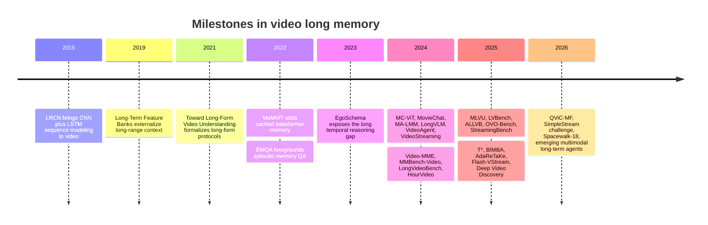
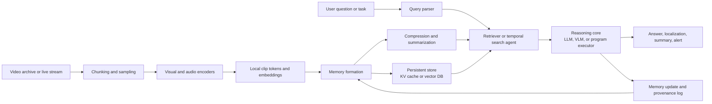

# Video Long Memory

## Executive summary

This report treats **video long memory** as the ability of a model or system to **retain, retrieve, and reason over information that is temporally distant, sparsely distributed, or no longer present in the current visual window**. Under that definition, the field now clearly spans three related regimes: **offline long-video understanding** of minutes-to-hours of video, **online or streaming understanding** where only the causal prefix is available, and an emerging **long-horizon video modeling/generation** regime concerned with preserving scene, identity, or world-state consistency over extended time. That operational view is consistent with benchmark design in EgoSchema, LongVideoBench, MLVU, OVO-Bench, and recent surveys that explicitly decompose video intelligence into watching, remembering, and reasoning. citeturn1search4turn16view2turn17view0turn18view0turn15search0

Historically, the field has moved from **sequence models** such as LRCN, to **external feature banks and recurrent memory** for recognition, to **transformer-era long-context mechanisms** such as MeMViT and MC-ViT, and finally to the present landscape of **hybrid systems** that combine compression, memory banks, retrieval, temporal search, and agentic tool use. The strongest current results are typically not obtained by naively processing more frames with a larger transformer, but by architectures that aggressively manage information flow: recurrent memory propagation, hierarchical compression, query-aware retrieval, or multi-step search. citeturn4search8turn31search3turn4search7turn10search5turn3search6turn3search13turn2search1turn7search0

The present benchmark picture is sobering. HourVideo reports a large human–model gap, with human experts at **85.0%** versus **37.3%** for Gemini Pro 1.5. LongVideoBench shows that the best open models are now close to proprietary systems when given enough frames, but their scores still fall substantially as duration grows. On the more extreme LVBench leaderboard accessed on **2026-07-10**, the top public entry is **Deep Video Discovery** at **74.2% overall**, while GPT-4o is listed at **48.9%**, suggesting that memory-aware retrieval and agentic search matter greatly once videos become very long and information-dense. On StreamingBench, the best overall scores are much higher on real-time perception than on contextual understanding, indicating that **recent-scene perception is improving faster than persistent memory and temporal reasoning**. citeturn17view1turn27view2turn16view0turn16view1

The most important technical conclusion is that the field is converging on a systems insight: **video long memory is not one problem but a coordination problem** among representation, compression, retrieval, temporal localization, and reasoning. At the same time, 2026 work such as **SimpleStream** shows that some purported memory gains disappear when compared against a strong recent-context baseline, meaning that future progress will require more rigorous evaluation and stronger ablations rather than more complicated memory modules by default. citeturn9search1turn15search0turn18view0turn18view1

## Assumptions, definitions, and scope

The user asked in English and explicitly requested an English report, so this report is in English. I interpret **“current”** as literature, leaderboards, project pages, and official product documentation publicly available up to **2026-07-10** in Asia/Singapore. Where public information is missing, especially for proprietary systems, I state that explicitly.

An operational definition is necessary, because the community still lacks a single universally adopted one. In this report, a task or method counts as **video long memory** if at least one of the following is true: it must answer questions using evidence spread across distant timestamps; it maintains a persistent state beyond the model’s immediate input window; or it must preserve long-horizon consistency across a continuing stream or generated sequence. EgoSchema’s notion of **temporal certificate sets** is especially important here: it was introduced precisely because clip length alone does not measure the true temporal difficulty of a task. LongVideoBench makes a closely related point by emphasizing **referred reasoning** that cannot be solved from just one frame or a few sparse frames. MLVU likewise argues that many earlier “long video” evaluations were not truly long-memory tasks because some questions could be answered from a single frame, celebrity prior knowledge, or text-only cues. citeturn1search4turn16view2turn17view0

With that definition, the scope of this report includes three families of work. The first is **long-form video understanding**, such as question answering, captioning, retrieval, action recognition, and long-horizon multimodal reasoning over minutes to hours of video. The second is **streaming or online video understanding**, where the system must answer at time \(t\) using only the causal prefix and must therefore exhibit temporal awareness and memory update behavior. The third is **video modeling in the broader sense of long-horizon world or scene modeling**, where memory is needed to preserve identity, geometry, or state consistency across generated shots or long rollouts. Public research remains far denser on the first two than on the third. citeturn18view0turn18view1turn19search0turn29search9

This report deliberately excludes two things unless they are explicitly memory-relevant. First, I do **not** count ordinary short-clip action recognition or generic video-language models as long-memory methods just because they accept “video” as input. Second, I do **not** treat every long video benchmark as a true long-memory benchmark, because some benchmarks can be partially solved with aggressive sparse sampling, subtitles alone, or shallow temporal heuristics. That distinction matters for interpreting results and for understanding why benchmark saturation can be misleading. citeturn16view2turn17view0turn1search17

## Historical evolution and milestones

The earliest phase of video long memory was really about **sequence modeling**, not explicit memory design. LRCN combined CNN perception with LSTM sequence modeling and established a template for processing variable-length visual inputs and producing sequence outputs. This line introduced the intuition that temporal state matters, but it did not yet solve the compute and storage problem of retaining rich evidence over long video horizons. citeturn4search8

A second phase introduced **externalized long-range context**. Long-Term Feature Banks proposed storing supportive information from the entire span of a video so that a short-clip recognizer could use context beyond its immediate window, and it achieved state-of-the-art results on AVA, EPIC-Kitchens, and Charades. This was a critical conceptual milestone because it separated “current processing” from “historical support,” which is still the core systems idea behind many modern long-memory architectures. In parallel, memory-oriented work also appeared in captioning and QA, for example memory-attended captioning models and episodic memory readers, though these systems were narrower and less scalable than later VideoLLMs. citeturn31search0turn31search3turn4search1turn4search10

By 2021–2022, the field became much more explicit about **long-form video understanding as a distinct research problem**. “Towards Long-Form Video Understanding” argued that short-term models fail to contextualize events over long horizons and proposed large-scale evaluation protocols for long-form tasks. MeMViT then showed that online memory inside a multiscale vision transformer could extend temporal support by **30×** with only **4.5%** more compute, while improving recognition on AVA and EPIC-Kitchens-100. Around the same time, EMQA framed episodic memory question answering as a specialized long-horizon VideoQA setting with explicit localization requirements. citeturn31search2turn4search7turn4search14

The period from 2023 onward marks the modern era, because the community finally obtained **diagnostic long-memory benchmarks**. EgoSchema demonstrated that even very large models were badly underpowered on truly long-form egocentric QA, measuring long-range temporal difficulty through intrinsic temporal length. In 2024, benchmarking broadened dramatically: Video-MME covered durations from **11 seconds to 1 hour** and multiple modalities; MMBench-Video introduced long-form web videos and GPT-4-based assessment for free-form questions; LongVideoBench explicitly targeted long-context referred reasoning with interleaved video and subtitles; and HourVideo moved to **20–120 minute** egocentric videos with a large human–model gap. These benchmarks collectively forced the field to move beyond “more frames = better video model.” citeturn1search4turn16view3turn13search8turn1search11turn17view1

At the same time, 2024 brought a wave of **memory-aware VideoLLMs**: MovieChat, MA-LMM, LongVLM, VideoAgent, MC-ViT, and VideoStreaming each proposed different ways to keep long-range information accessible without feeding every frame directly into the final LLM. In 2025 and 2026, the next shift became visible: **query-aware retrieval, compression, and agentic search** began outperforming monolithic encoders on harder benchmarks. T* reframed temporal search as a spatial search problem, AdaReTaKe pushed context capacity from **256 to 2048 frames**, Flash-VStream emphasized real-time streaming latency, Deep Video Discovery led the LVBench leaderboard, and QViC-MF showed that memory should not only receive compressed information from perception but should also **feed back** into perception itself. In short, the field has moved from “how do we remember more?” to “how do we remember the right things, retrieve them cheaply, and reason with them faithfully?” citeturn2search6turn3search6turn3search8turn20view4turn10search5turn3search13turn8search2turn21view5turn9search2turn7search0turn21view4

The milestone structure is summarized below.

This timeline is synthesized from the paper and benchmark record above. citeturn4search8turn31search3turn31search2turn4search7turn4search14turn1search4turn10search5turn2search6turn3search6turn3search8turn20view4turn3search13turn17view0turn5search3turn17view4turn5search1turn5search4turn8search2turn9search0turn7search1turn9search2turn7search0turn10search6turn9search1turn14search1turn29search0

## Current models, architectures, datasets, and metrics

### Architecture patterns that currently dominate

By mid-2026, the field is best understood as four architecture families. The first family is **recurrent or streaming memory**, where clips are processed causally and a fixed-size memory is propagated forward. MeMViT, MA-LMM, VideoStreaming, Flash-VStream, and StreamMem are representative: they all avoid full quadratic attention over all frames by carrying forward a compact summary, cache, or memory bank. citeturn4search7turn3search6turn3search13turn9search2turn7search3

The second family is **hierarchical compression**, which tries to preserve enough fine detail while reducing token count. LongVLM uses segment-level token merging plus global semantics; MC-ViT performs non-parametric memory consolidation; BIMBA replaces attention-style compression with selective-scan/state-space compression; ReTaKe and AdaReTaKe explicitly attack redundancy in time, layers, and knowledge states; and QViC-MF makes compression question-aware and allows memory feedback into current visual processing. citeturn3search0turn10search5turn9search0turn8search0turn7search1turn10search6

The third family is **query-aware retrieval and agentic search**. Instead of compressing the whole video into one memory state, these systems search for likely evidence when a question is asked. VideoAgent uses an LLM agent with visual tools, VideoTree builds a hierarchical query-adaptive tree, T* performs iterative temporal search, VCA uses curiosity-driven exploration, and Deep Video Discovery plans over a multi-granular searchable video database. These methods are often strongest on very long videos because they spend compute where the evidence is, rather than everywhere. citeturn20view4turn2search1turn8search2turn2search10turn7search0

The fourth family is an increasingly important **skeptical baseline family**. SimpleStream shows that on some streaming benchmarks, a sliding window over only the most recent frames can match or beat more elaborate memory systems. That does **not** mean long memory is unnecessary. It means future claims must be benchmarked against strong recent-context baselines and must show gains specifically on delayed evidence, backtracking, causal linkage, or question-after-ingestion scenarios. citeturn9search1turn18view0turn18view1

### Representative model comparison

The table below compares representative systems. Performance numbers are **not directly comparable across rows**, because tasks, modalities, and evaluation protocols differ substantially. That heterogeneity is itself a central fact about the field. citeturn16view2turn17view0turn17view1

| Name | Year | Key idea | Memory mechanism | Dataset used | Performance | Limitations |
|---|---:|---|---|---|---|---|
| MeMViT citeturn4search7 | 2022 | Online multiscale transformer for long-term recognition | Cached attention memory from previous clips | AVA; EPIC-Kitchens-100 | Extends temporal support **30×** with only **4.5%** more compute; reports SOTA on AVA and EPIC-Kitchens-100 action classification and anticipation citeturn4search7turn4search3 | Recognition-centric; not designed for open-ended long-video QA or multimodal dialogue |
| MC-ViT citeturn10search5 | 2024 | Re-purpose pretrained video transformers with non-parametric memory consolidation | Consolidated memory derived from past activations | EgoSchema; Perception Test; Next-QA; Diving48 | MC-ViT-L reports **44.4** on EgoSchema full, **48.1** on Perception Test, and **65.0** on Next-QA citeturn26view2 | Requires task-specific fine-tuning; still limited compared with minute-to-hour VideoLLM settings |
| MovieChat citeturn2search6 | 2024 | Dense-to-sparse memory for ultra-long videos with dialogue | Short-term plus long-term Transformer memory tokens with sliding window | MovieChat-1K; MSVD-QA; MSRVTT-QA; ActivityNet-QA | Handles **>10K frames** on a **24GB** GPU; short-video QA scores of **75.2 / 52.7 / 45.7** on MSVD / MSRVTT / ActivityNet-QA; introduces MovieChat-1K citeturn22view0turn22view4 | Movie-focused benchmark; not directly aligned with newer long-memory benchmarks such as LVBench or StreamingBench |
| MA-LMM citeturn3search6 | 2024 | Plug-and-play long-term memory for multimodal LLMs | Sequential processing with a compressed memory bank | LVU; Breakfast; COIN; MSRVTT; MSVD; ActivityNet; YouCook2 | **63.0** average on LVU; **93.0** on Breakfast and **93.2** on COIN; **60.6** on MSVD QA citeturn25view4 | Question-agnostic memory may miss rare task-specific details; primarily offline |
| LongVLM citeturn3search0 | 2024 | Segment-level local features plus global semantics | Hierarchical token merging across short segments | VideoChatGPT benchmark; ANET-QA; MSRVTT-QA; MSVD-QA | **47.6 / 59.8 / 70.0** on ANET-QA / MSRVTT-QA / MSVD-QA, improving over BT-Adapter citeturn23view3 | Focuses on efficient long-video encoding, but not explicit retrieval or streaming interaction |
| VideoStreaming citeturn3search13 | 2024 | Constant-token streaming encoder plus adaptive memory selection | Memory-propagated streaming encoding and question-conditioned memory selection | EgoSchema; Next-QA; Next-GQA; MovieChat-1K; MovieNet-QA | **44.1** on EgoSchema fullset, **66.2** on Next-QA, **17.8** Acc@GQA on Next-GQA, **90.4 / 54.9** global/breakpoint accuracy on MovieChat-1K citeturn24view2turn30view0 | Multi-stage design; quality depends on selection accuracy and encoded summaries |
| VideoTree citeturn2search1 | 2024 | Training-free hierarchical query-adaptive tree for coarse-to-fine evidence search | Query-aware frame selection and hierarchical aggregation | EgoSchema; NExT-QA; Video-MME long | **61.1%** on EgoSchema and **75.6%** on NExT-QA; reported stronger than GPT-4V on Video-MME long citeturn2search1 | Search-time latency; depends on query availability and captioning/retrieval quality |
| AdaReTaKe citeturn7search1 | 2025 | Adaptive redundancy reduction in time and layers | Training-free compression of visual redundancy and KV states | Video-MME; MLVU; LongVideoBench; LVBench | Expands processing from **256 to 2048 frames** and reports gains of **2.3%** for 7B and **2.8%** for 72B models, with even larger gains on LVBench citeturn21view5turn7search1 | Still compressive, so rare clues can be lost; gains depend on the base backbone |
| Deep Video Discovery citeturn7search0 | 2025 | Agentic search with multi-granular tools over indexed video clips | Searchable segmented video database with iterative tool use | Multiple long-video benchmarks; especially LVBench | Public LVBench leaderboard lists **74.2% overall**, far above GPT-4o’s listed **48.9%** on that benchmark citeturn16view0turn7search0 | Complex infrastructure; retrieval database construction and tool orchestration cost are nontrivial |
| Flash-VStream citeturn9search2 | 2025 | Real-time long-stream understanding with two-process architecture | Flash Memory with context synopsis and detail augmentation memories | EgoSchema; MLVU; LVBench; MVBench; Video-MME | Generates the first token **within one second** and reports SOTA on full EgoSchema with strong efficiency-accuracy trade-offs citeturn20view8 | Optimized for real-time use; may trade some exhaustive offline reasoning for latency |
| QViC-MF citeturn10search6 | 2026 | Question-guided compression with memory feedback into perception | Question-aware selective attention plus iterative memory feedback | MLVU; LVBench; VNBench Long; VideoMME Long | Reports improvements over prior SOTA of **6.1%** on MLVU, **8.3%** on LVBench, **18.3%** on VNBench Long, and **3.7%** on VideoMME Long citeturn21view4 | Query-aware design is powerful but less suitable for archive ingestion when questions are unknown in advance |

A separate but important 2026 result is **SimpleStream**, a deliberately minimal baseline that uses only recent frames and no explicit long-term memory, yet reaches **67.7%** on OVO-Bench and **80.59%** on StreamingBench with only four recent frames. This matters analytically because it shows that some benchmark gains previously attributed to “memory” were at least partly due to stronger near-term perception or better backbones; future papers need to prove a real long-memory advantage under matched protocols. citeturn9search1

### Benchmark and dataset landscape

The benchmark ecosystem has become substantially richer, and it now diagnoses different forms of memory failure rather than only overall QA accuracy.

| Benchmark | Year | Scope and duration | Main task | Main metric | Why it matters | Key caveat |
|---|---:|---|---|---|---|---|
| EgoSchema citeturn1search4 | 2023 | >5,000 human-curated MCQ pairs over >250 hours of 3-minute egocentric video | Long-form VideoQA | Accuracy | Introduces temporal certificate sets; strong diagnostic of intrinsic temporal difficulty | Still multiple-choice and egocentric |
| Video-MME citeturn16view3 | 2024 | 900 videos, 254 hours, durations from **11 seconds to 1 hour**, with video, subtitles, and audio | Broad video understanding | Accuracy citeturn13search9 | Widely used “full-spectrum” benchmark across durations and modalities | Emerging saturation motivated Video-MME-v2 citeturn1search17 |
| MMBench-Video citeturn13search8 | 2024 | Long-form multi-shot web videos with human-authored free-form questions | General video understanding | GPT-4-based automatic assessment | Useful for open-ended responses and temporal reasoning taxonomies | Judge-model dependence |
| LongVideoBench citeturn1search11 | 2024 | 3,763 interleaved video-subtitle examples up to **1 hour** | Referred reasoning over long context | Accuracy by duration and total score | Good stress test for sparse referred evidence and long-context multimodal integration | Still mostly offline QA |
| HourVideo citeturn17view1 | 2024 | 500 Ego4D videos of **20–120 minutes** with 12,976 MCQs | Summarization, perception, causal and counterfactual reasoning, navigation | Five-way MC accuracy | One of the clearest human-vs-model gap indicators in hour-long video | Egocentric only |
| StreamingBench citeturn18view1 | 2024 | 900 videos, 4,500 QA pairs, questions posed at multiple time points | Streaming understanding | Overall plus real-time, omni-source, contextual subtotals | Separates recent-scene perception from contextual memory demands | Only a first-generation streaming benchmark |
| MLVU citeturn17view0 | 2025 | Long videos from **3 minutes to 2 hours** across movies, surveillance, egocentric video, and cartoons | Multi-task long-video understanding | M-Avg and G-Avg; task-wise scores | Strong breadth across holistic, single-detail, and multi-detail tasks | Multiple metrics complicate simple leaderboard comparison |
| OVO-Bench citeturn18view0 | 2025 | 644 videos and ~2,800 timestamped annotations | Online temporal awareness | Accuracy over backward tracing, real-time, and forward active responding | Diagnoses causal-prefix reasoning and when to answer vs wait | Less emphasis on multimodal archive retrieval |
| LVBench citeturn16view4 | 2025 | Extreme long video benchmark over TV, sports, surveillance, etc. | Long-video comprehension and information extraction | Accuracy and category breakdowns | Very challenging; strongly rewards retrieval and agentic search | Public leaderboard is dynamic and mixes model classes |
| ALLVB citeturn17view4 | 2025 | **1,376 videos**, **16 categories**, average length nearly **2 hours**, **252k QAs** | Integrated QA versions of 9 major tasks | Individual and average task accuracy | Largest all-in-one long-video benchmark by scale | GPT-4o-assisted automated annotation raises evaluation-design questions |
| Causal2Needles citeturn14search7turn14search19 | 2025 | Long-context videos with causally related distant events | Joint reasoning over two temporal “needles” | Accuracy | Explicitly stress-tests distant-event causal linkage | New and narrower than general benchmarks |
| Spacewalk-18 citeturn14search1turn14search9 | 2026 | Long-form procedural ISS spacewalk videos with multimodal cues | Step recognition and video QA | Task accuracy | Valuable for domain shift and long procedural memory | Domain-specific, so absolute comparison to web-video benchmarks is limited |

Two benchmark trends are particularly important. First, **longer videos are usually harder even for frontier models**, and explicit duration bucketing is therefore more informative than one overall mean. LongVideoBench’s official leaderboard shows GPT-4o at **66.7 overall**, but only **61.6** on the longest **900–3600 second** group; the best open English-language models are now close behind when given many frames. Second, evaluation is branching into more specialized probes: temporal awareness in OVO-Bench, contextual streaming in StreamingBench, multi-detail decomposition in MLVU, synthetic sparse-clue probing in VNBench, and causal distant-event linking in Causal2Needles. citeturn27view2turn18view0turn18view1turn28view2turn14search14turn14search19

### Evaluation metrics and what they really measure

| Metric family | Used by | Measures | Strength | Limitation |
|---|---|---|---|---|
| Multiple-choice accuracy | EgoSchema, Video-MME, HourVideo, LVBench citeturn1search4turn13search9turn17view1turn16view0 | Correct answer selection | Cheap, reproducible, broad leaderboard compatibility | Can saturate; often conflates memory with instruction following and option parsing |
| Mean task accuracy and task-wise averages | MLVU uses **M-Avg** and **G-Avg** citeturn30view3turn28view2 | Average performance across multi-detail and generative tasks | Better than one aggregate score for heterogeneous task suites | Can hide catastrophic failure on specific subskills |
| Duration-stratified accuracy | LongVideoBench; Video-MME leaderboards emphasize length groups citeturn27view2turn16view3 | Whether performance degrades as context length grows | Directly diagnoses scaling with temporal horizon | Still does not show whether the model retrieved the right evidence |
| LLM-assisted free-form scoring | MMBench-Video and VideoChatGPT-style evaluations in LongVLM/MovieChat citeturn13search8turn23view3turn22view4 | Response quality, detail, consistency | Supports open-ended responses beyond MCQ | Judge bias, prompt sensitivity, and weak evidence attribution |
| Temporal grounding metrics such as IoU, IoP, Acc@GQA | Next-GQA and VideoStreaming citeturn30view0 | Whether the model localizes evidence and grounds answers visually | Much closer to true long-memory retrieval quality | Annotation is expensive and benchmark coverage is still limited |
| Needle, ordering, and counting accuracies | VNBench and related synthetic probes citeturn14search14turn14search10 | Recovery of sparse, temporally distant clues | Good for isolating memory failure modes | Synthetic tasks may diverge from natural narrative understanding |
| Efficiency metrics such as frame budget, tokens, latency, time-to-first-token, and VRAM | MovieChat, AdaReTaKe, Flash-VStream, SimpleStream citeturn22view0turn21view5turn20view8turn9search1 | Cost of memory and real-time viability | Essential for deployment and fair systems comparison | Poorly standardized across hardware, precision, and preprocessing settings |

The central evaluation problem is that the field still lacks a **unified memory-specific metric** analogous to perplexity in language modeling. Today’s leaderboards mainly measure task success, while only partially exposing whether a method truly preserved and retrieved distant evidence, whether it hallucinated unsupported links, how much it forgot over time, or how much compute it consumed to do so. This is one reason why the same model class can look strong on one benchmark and weak on another. It is also why benchmark designers are increasingly adding duration slices, temporal localization metrics, and streaming-time protocols. citeturn16view2turn18view0turn18view1turn28view2

## Practical systems and industry deployments

Public industry deployments currently emphasize **usable memory systems** more than academically pure long-video encoders. In practice, commercially documented systems usually follow one of two patterns. The first is a **very-long-context multimodal model** with managed preprocessing, server-side compression, and timestamped media ingestion. The second is an **embedding plus retrieval stack**, where videos are segmented, indexed, searched semantically, and then summarized or questioned via a language model. From public documentation, this retrieval-centric pattern appears more deployment-ready because it is easier to scale, audit, and integrate into enterprise databases. That last point is an inference from product architecture and documentation, not a vendor-disclosed theorem. citeturn11search0turn11search2turn12search3turn12search7turn12search8turn11search5turn11search11

| Public system | Publicly documented capability | Externally visible memory strategy | Public deployment evidence | What is not public |
|---|---|---|---|---|
| Google Gemini API for video citeturn11search0turn11search2 | All Gemini models can process video; **1M-context** models can handle up to **1 hour** at default media resolution or **3 hours** at lower resolution | Long context plus server-side media downsampling; File API stores video at **1 fps** and audio at **1 Kbps** with one-second timestamps | Official developer docs and long-context guidance | Internal long-memory architecture, retrieval policy, and evidence-trace internals are not publicly specified |
| Gemini Live API citeturn11search10 | Low-latency continuous voice and vision interaction | Continuous streaming input state over sessions | Official preview docs | No public technical description of how persistent visual memory is represented |
| TwelveLabs Marengo and Pegasus on Amazon Bedrock citeturn12search0turn12search3turn12search8turn12search12 | Video search, scene classification, summarization, and question answering available as managed services | Persistent multimodal embeddings plus analysis models; external vector memory is the visible abstraction | AWS launch posts and Bedrock model cards | Internal training mixture, retrieval heuristics, and benchmark parity with long-memory academic results |
| TwelveLabs plus vector database integrations citeturn11search5turn11search11turn12search5turn12search9 | Semantic video search and multimodal RAG using Qdrant, Chroma, OpenSearch, or S3 Vectors | Persistent vector stores over segmented video embeddings | Official tutorials and partner integrations | End-to-end QA faithfulness and recall under very long multi-hour archives |
| TwelveLabs lecture-analysis tutorial on Bedrock citeturn12search17 | Study guides, chapter timelines, transcripts, and practice questions from educational videos | Retrieval and summarization over embedded long-form video | Official application tutorial | Generalization beyond tutorial domain and exact evaluation protocol |

A useful way to read this table is that **industry deployments expose memory as infrastructure**, whereas research papers often expose memory as an internal neural module. In products, “memory” often means persistent embeddings, searchable indexes, cached media representations, or context-managed multimodal sessions. In papers, it more often means tokens, latent states, or learned read/write banks. This difference explains why research leaderboards and production stacks can look surprisingly different even when they solve closely related problems. citeturn11search0turn12search7turn7search0turn20view8

The typical deployment architecture now looks like this.

This flow abstracts the common ideas behind VideoStreaming’s memory propagation and adaptive selection, VideoTree’s query-adaptive evidence tree, Flash-VStream’s fixed-size streaming memory, Deep Video Discovery’s searchable multi-granular tool stack, and the embedding-and-retrieval workflows documented by Google and TwelveLabs. citeturn3search13turn2search1turn9search2turn7search0turn11search0turn12search7

Two caveats are important. First, public product documentation usually advertises **capability** rather than algorithmic detail, so it is often impossible to identify the exact memory mechanism with the same precision available for academic papers. Second, reproducible public comparisons between deployed products and academic long-memory models remain thin. Where vendor blogs show application tutorials, those should be read as evidence of deployment pattern, not as controlled scientific benchmarks. citeturn11search0turn12search17turn12search5

## Open problems, technical challenges, and future directions

### Why the problem remains scientifically hard

The first persistent challenge is **scalability under information sparsity**. Natural videos are highly redundant most of the time and extremely information-dense at a few critical moments. Full attention is too expensive, but aggressive compression can delete the one frame, subtitle, object state, or sound cue that a later question depends on. MeMViT, MC-ViT, BIMBA, ReTaKe, AdaReTaKe, and Flash-VStream all address different pieces of this issue, which is itself evidence that no single compression recipe has won yet. The SimpleStream result sharpens the point: if a memory method cannot beat a strong recent-window baseline on memory-specific tasks, then it may be solving the wrong bottleneck. citeturn4search7turn10search5turn9search0turn8search0turn7search1turn9search2turn9search1

The second challenge is **representation**. A long-memory system must preserve at least three kinds of information at once: fine visual details, event structure, and abstract semantics. If it stores only abstract summaries, it loses evidence needed for local or breakpoint questions. If it stores only clips or frames, retrieval becomes too expensive and memory blows up. If it stores only query-aware information, it becomes brittle when questions are unknown at ingestion time. This is why current systems are moving toward layered memory designs: local detail memory, global narrative memory, and external searchable memory are increasingly all present in the same stack. citeturn2search6turn20view8turn10search6turn29search0

The third challenge is **retrieval and temporal reasoning**. Many difficult questions are not about recognizing a single action but about linking scattered clues: what changed between two moments, what caused a later event, or when enough evidence has accumulated to answer. LongVideoBench, OVO-Bench, HourVideo, and Causal2Needles all stress this type of reasoning. VideoTree, T*, VideoAgent, VCA, and Deep Video Discovery all exist because the field has learned that long memory without good temporal search is often not enough. citeturn16view2turn18view0turn17view1turn14search19turn2search1turn8search2turn20view4turn2search10turn7search0

The fourth challenge is **continual learning and multi-session persistence**. Most standard benchmarks still ask questions about one video at a time. Real agents, however, should accumulate knowledge across episodes, build semantic memory about recurring entities, update beliefs, and avoid catastrophic forgetting. M3-Agent is an important step because it explicitly distinguishes episodic and semantic memory and introduces M3-Bench for memory-based reasoning in longer agent settings. But this subfield is still young, and the “infinite video understanding” framing remains more of a research agenda than a solved benchmark ecosystem. citeturn29search0turn29search2

The fifth challenge is **annotation and benchmark quality**. Long videos are expensive to annotate, hard to quality-control, and especially vulnerable to text-only shortcuts or dataset leakage. LVBench uses a mix of manual annotation and model assistance; ALLVB uses an automated GPT-4o pipeline with human quality control; and VideoNIAH/VNBench uses synthetic “needle” insertion to lower annotation cost and isolate specific skills. These are ingenious responses to an economic bottleneck, but they also raise the risk that the benchmark tests the annotation pipeline’s biases as much as the model’s memory. citeturn16view4turn17view4turn14search14turn14search10

### Concrete challenge map

| Challenge | Why it is hard | Representative evidence | Promising response |
|---|---|---|---|
| Scalability | Token count grows with time, but salient evidence is sparse | MeMViT 30× temporal support; AdaReTaKe 256→2048 frames; Flash-VStream targets sub-second responses citeturn4search7turn21view5turn20view8 | Hierarchical compression, state-space models, sparse KV memories, stronger efficiency reporting |
| Representation | Need local detail and global semantics simultaneously | MovieChat, MA-LMM, QViC-MF, M3-Agent all separate memory roles differently citeturn22view0turn25view4turn21view4turn29search0 | Multi-tier memory with explicit local, episodic, and semantic stores |
| Retrieval | Distant evidence must be found cheaply, not just stored | VideoTree, T*, VideoAgent, Deep Video Discovery citeturn2search1turn8search2turn20view4turn7search0 | Learn retrieval policies jointly with reasoning; add provenance outputs |
| Temporal reasoning | Linking changes, causes, and delayed consequences remains weak | HourVideo human 85.0 vs Gemini 37.3; Causal2Needles and OVO-Bench explicitly expose gaps citeturn17view1turn14search19turn18view0 | Causality-focused training data; temporal programs; event graphs |
| Streaming temporal awareness | The system must know what it has seen, what it has not seen, and when to answer | OVO-Bench, StreamingBench, SimpleStream citeturn18view0turn18view1turn9search1 | Benchmarks that separate current-scene perception from long-memory retrieval |
| Continual learning | Must update memory without catastrophic forgetting | M3-Agent and Infinite Video Understanding agenda citeturn29search0turn29search2 | Cross-session benchmarks, replay, semantic memory consolidation |
| Annotation and supervision | Long videos are costly to label and easy to shortcut | LVBench, ALLVB, VideoNIAH / VNBench citeturn16view4turn17view4turn14search14 | Human-in-the-loop pipelines, synthetic probes plus natural benchmarks |
| Evaluation faithfulness | Accuracy does not prove correct memory retrieval | MMBench-Video judge-based scoring; Next-GQA grounding; Video-MME-v2 saturation concern citeturn13search8turn30view0turn1search17 | Evidence-grounded scoring, retention curves, calibrated uncertainty, matched-cost comparisons |

### Promising future directions

The most promising direction is probably **hierarchical memory as a systems primitive**, not a single module. The likely winning design will combine a fast **working memory** for recent perception, an **episodic store** for retrievable clip-level evidence, and a **semantic memory** that consolidates reusable facts, entities, and event abstractions. This is already visible in M3-Agent’s episodic/semantic split, in Flash-VStream’s split between context synopsis and detail augmentation memory, and in the broader “watch, remember, reason” perspective articulated by the 2026 survey. citeturn29search0turn20view8turn15search0

A second promising direction is **memory-aware training objectives instead of memory-aware inference alone**. Many current methods are training-free or inference-time wrappers, which is attractive pragmatically but can limit what the model learns about memory formation, forgetting, or retrieval. Future systems will likely train directly for evidence localization, delayed questioning, archival reuse, and memory compression under budget constraints rather than relying only on instruction tuning for short-video QA. QViC-MF and ReWind already point in this direction by coupling memory behavior more tightly to the task and the question. citeturn10search6turn31search20

A third important direction is **agentic temporal search with provenance**. T*, VideoTree, Deep Video Discovery, and VideoARM indicate that long-video reasoning often benefits from an explicit search loop rather than one-shot inference. The next step should be to make such systems more auditable: when a model answers, it should cite the clip ranges, frames, subtitles, or audio snippets used, and benchmarks should verify not only answer correctness but also evidence faithfulness. citeturn8search2turn2search1turn7search0turn8search18

A fourth direction is **benchmark redesign**. Strong future benchmarks should combine at least five ingredients: natural long videos, delayed questions, multi-needle or causal dependencies, matched-cost protocols, and grounding-based evaluation. Existing pieces are already available in distributed form across EgoSchema, LongVideoBench, OVO-Bench, StreamingBench, Causal2Needles, and Spacewalk-18. What is missing is a unified benchmark suite that measures retention, retrieval, reasoning, and efficiency together. citeturn1search4turn16view2turn18view0turn18view1turn14search19turn14search1

A fifth direction concerns **video modeling and generation**, where long memory is increasingly visible but still less standardized than in understanding. Public work includes **Corgi**, which uses cached memory for multi-scene generation and reports gains in long-term consistency; **Video World Models with Long-term Spatial Memory**, which uses geometry-grounded memory for persistent world-state; and **EM-Vid**, which proposes entity-centric memory for consistent multi-shot generation. These papers indicate that the “modeling” side of video long memory is becoming serious. However, relative to the benchmark-rich understanding side, I did **not** find an equally mature public benchmark ecosystem for long-memory video generation by 2026-07-10; the area is promising but still structurally earlier. citeturn19search18turn19search0turn29search9

My bottom-line forecast is that the next substantial advance will likely come from **memory-aware multimodal systems that unify ingestion, compression, retrieval, reasoning, and evidence attribution**, rather than from simply increasing the raw frame budget of a monolithic foundation model. The field’s most robust recent lessons all point in that direction. citeturn7search0turn10search6turn29search0turn15search0

## References

Donahue, J. et al. *Long-Term Recurrent Convolutional Networks for Visual Recognition and Description*. CVPR 2015. citeturn4search8

Wu, C.-Y. et al. *Long-Term Feature Banks for Detailed Video Understanding*. CVPR 2019. citeturn31search0turn31search3

Wu, C.-Y., Krähenbühl, P. *Towards Long-Form Video Understanding*. CVPR 2021. citeturn31search1turn31search2

Wu, C.-Y. et al. *MeMViT: Memory-Augmented Multiscale Vision Transformer for Efficient Long-Term Video Recognition*. CVPR 2022. citeturn4search7turn4search3

Datta, S. et al. *Episodic Memory Question Answering*. CVPR 2022. citeturn4search14turn4search2

Mangalam, K. et al. *EgoSchema: A Diagnostic Benchmark for Very Long-form Video Language Understanding*. 2023. citeturn1search4turn1search16

Balažević, I. et al. *Memory Consolidation Enables Long-Context Video Understanding*. ICML 2024. citeturn10search5turn26view2

Song, E. et al. *MovieChat: From Dense Token to Sparse Memory for Long Video Understanding*. CVPR 2024. citeturn2search6turn22view0turn22view4

He, B. et al. *MA-LMM: Memory-Augmented Large Multimodal Model for Long-Term Video Understanding*. CVPR 2024. citeturn3search6turn25view4

Weng, Y. et al. *LongVLM: Efficient Long Video Understanding via Large Language Models*. ECCV 2024. citeturn3search8turn23view3

Wang, X. et al. *VideoAgent: Long-form Video Understanding with Large Language Model as Agent*. ECCV 2024. citeturn20view4

Qian, R. et al. *Streaming Long Video Understanding with Large Language Models*. NeurIPS 2024. citeturn3search13turn24view2

Fu, C. et al. *Video-MME: The First-Ever Comprehensive Evaluation Benchmark of Multi-modal LLMs in Video Analysis*. 2024. citeturn16view3turn13search9

Fang, X. et al. *MMBench-Video: A Long-Form Multi-Shot Benchmark for Holistic Video Understanding*. NeurIPS 2024 Datasets and Benchmarks. citeturn13search8

Wu, H. et al. *LongVideoBench: A Benchmark for Long-context Interleaved Video-Language Understanding*. NeurIPS 2024 Datasets and Benchmarks. citeturn1search11turn16view2

Chandrasegaran, K. et al. *HourVideo: 1-Hour Video-Language Understanding*. NeurIPS 2024 Datasets and Benchmarks. citeturn17view1

Zhou, J. et al. *MLVU: Benchmarking Multi-task Long Video Understanding*. CVPR 2025. citeturn17view0turn28view2

Wang, W. et al. *LVBench: An Extreme Long Video Understanding Benchmark*. ICCV 2025. citeturn5search19turn16view0

Tan, X. et al. *ALLVB: All-in-One Long Video Understanding Benchmark*. AAAI 2025. citeturn17view4

Li, Y. et al. *OVO-Bench: How Far is Your Video-LLMs from Real-World Online Video Understanding?* CVPR 2025. citeturn18view0

Lin, J. et al. *StreamingBench: Assessing the Gap for MLLMs to Achieve Streaming Video Understanding*. 2024. citeturn18view1

Zhao, Z. et al. *Needle In A Video Haystack: A Scalable Synthetic Evaluator for Video MLLMs*. 2024. citeturn14search14

Ye, J. et al. *T*: Re-thinking Temporal Search for Long-Form Video Understanding*. CVPR 2025. citeturn8search2turn20view5

Islam, M. M. et al. *BIMBA: Selective-Scan Compression for Long-Range Video Question Answering*. CVPR 2025. citeturn9search0turn9search4

Wang, X. et al. *AdaReTaKe: Adaptive Redundancy Reduction to Perceive Longer for Video-language Understanding*. 2025. citeturn7search1turn21view5

Zhang, X. et al. *Deep Video Discovery: Agentic Search with Tool Use for Long-form Video Understanding*. 2025. citeturn7search0turn7search4

Zhang, H. et al. *Flash-VStream: Efficient Real-Time Understanding for Long Video Streams*. ICCV 2025. citeturn9search2turn20view8

Long, L. et al. *Seeing, Listening, Remembering, and Reasoning: A Multimodal Agent with Long-Term Memory*. 2025. citeturn29search0turn29search8

Li, M., Chao, Q., Li, B. *Two Causally Related Needles in a Video Haystack*. NeurIPS 2025 Datasets and Benchmarks. citeturn14search19turn14search7

Yamao, S. et al. *Question-guided Visual Compression with Memory Feedback for Long-Term Video Understanding*. CVPR 2026. citeturn10search6turn21view4

Shen, Y. et al. *A Simple Baseline for Streaming Video Understanding*. 2026. citeturn9search1

Tang, Z. et al. *Spacewalk-18: A Benchmark for Multimodal and Long-form Procedural Video Understanding in Novel Domains*. WACV 2026. citeturn14search1turn14search9

Meng, J. et al. *Watch, Remember, Reason: Human-View Video Understanding with MLLMs*. 2026. citeturn15search0

Wu, T. et al. *Video World Models with Long-term Spatial Memory*. 2025. citeturn19search0turn19search15

Wu, X. et al. *Corgi: Cached Memory Guided Video Generation*. WACV 2025. citeturn19search18

Vandersanden, J. et al. *EM-Vid: Training-Free Entity-Centric Memory for Efficient and Consistent Multi-Shot Video Generation*. 2026. citeturn29search9

Google. *Video understanding | Gemini API*. Official developer documentation. citeturn11search0

Google. *Long context | Gemini API*. Official developer documentation. citeturn11search2

Google. *Gemini Live API overview*. Official developer documentation. citeturn11search10

AWS. *TwelveLabs video understanding models are now available in Amazon Bedrock*. Official AWS announcement, 2025. citeturn12search0

AWS. *Introducing TwelveLabs in Amazon Bedrock*. Official Bedrock provider page. citeturn12search3

AWS. *TwelveLabs models now available fully managed in Amazon Bedrock*. Official AWS “What’s New”, 2025. citeturn12search8

AWS. *TwelveLabs Pegasus 1.2 model card for Amazon Bedrock*. Official documentation. citeturn12search12

TwelveLabs. *Amazon Bedrock integration docs*. Official documentation. citeturn12search7

TwelveLabs. *Semantic Video Search Workflow with Qdrant*. Official tutorial. citeturn11search5

TwelveLabs. *Multimodal RAG with Chroma*. Official tutorial. citeturn11search11

TwelveLabs. *Finding Needles in Video Haystacks with Marengo and Elasticsearch*. Official tutorial. citeturn12search5

TwelveLabs. *Lecture Analysis Platform on AWS Bedrock*. Official tutorial. citeturn12search17