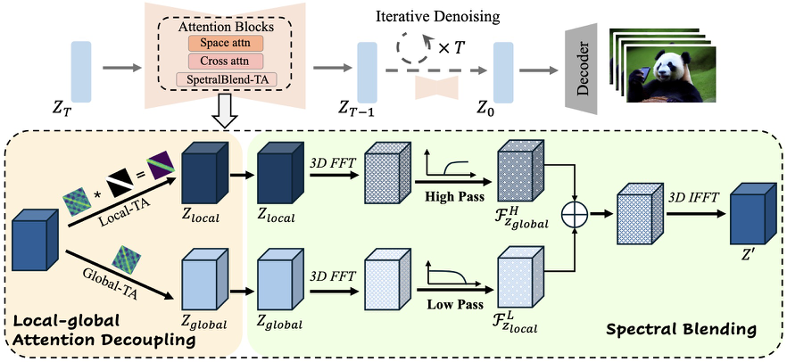
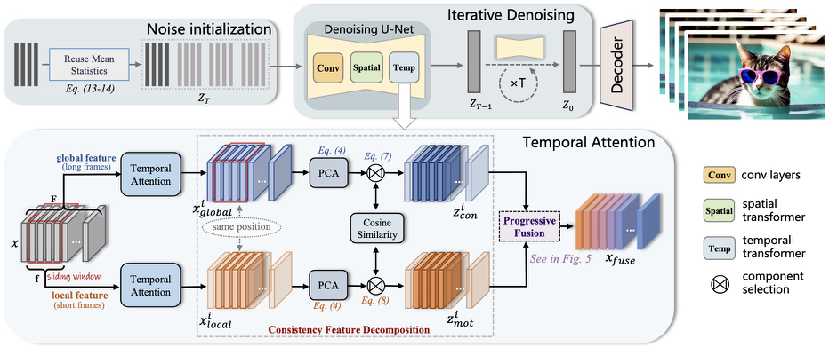
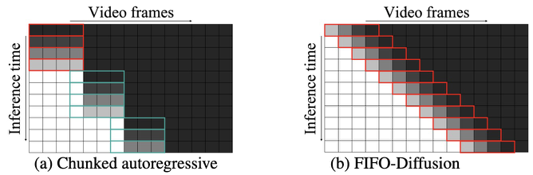
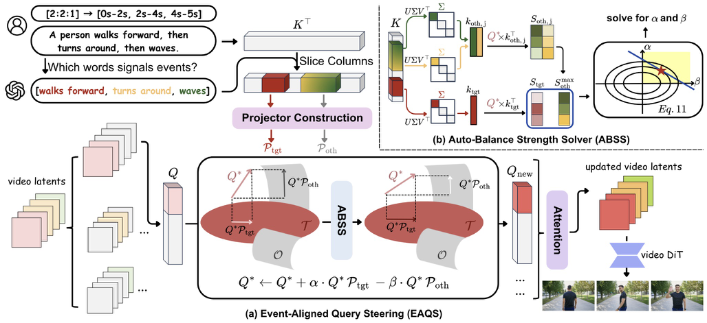
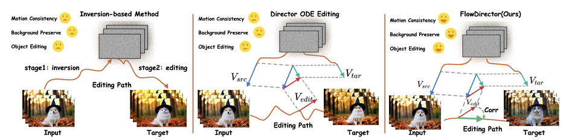

## Training-free Long Video Generation {#sec-long}

Long video generation with video diffusion models is a fundamental problem in artificial intelligence. Due to the constrain of computation and data resources, current video diffusion models are mainly trained on short video clips, posing a key challenge in generating long video with training-free frameworks. In this section, works from four aspects, including **consistency, efficiency, multi-event and editing**, are discussed.

### Consistency {#sec-consistency}

Improving long video consistency is a challenge that generating fixed-length long video with short-clip training video diffusion models. The most naive way is direct sampling and sliding window. Direct sampling neglects the short-clip training, simply modifying the time length. Sliding window strategy brings part of the previous denoised frames in current denoising window, posing a constrain for continuity. However, these two naive methods fail at long-term consistency and quality, leading to the proposal of following methods.

#### FreeLong {#sec-freelong}

**Motivation.** **Freelong** is a training-free framework for extending pre-trained short video diffusion models to long video generation. It analyzes the failure mode of direct long-video sampling from a frequency-domain perspective. Their key observation is that low-frequency components remain relatively stable as video length increases, while high-frequency components become severely distorted. More specifically, spatial high-frequency information is weakened, producing blurry frames, whereas temporal high-frequency information is amplified, causing flickering and inconsistent motion. In addition, temporal attention maps become less structured for long sequences, indicating that short-video models struggle to capture long-range dependencies.

<figure class="article-figure">
  
  <figcaption>Overview of the FreeLong framework. The SpectralBlend Temporal Attention mechanism decouples temporal attention into global and local branches, transforms features to the frequency domain via 3D FFT, and merges low-frequency components from the global branch with high-frequency components from the local branch for enhanced long-video consistency.</figcaption>
</figure>

**Method.** To address this issue, the paper proposes *SpectralBlend Temporal Attention*, the core module of FreeLong. The method decouples temporal attention into two branches: a global branch that attends to the entire sequence and preserves long-range consistency, and a local branch that only attends to neighboring frames and thus retains fine spatial-temporal details. The two features are then transformed into the frequency domain with 3D FFT. FreeLong keeps the low-frequency components from the global feature and the high-frequency components from the local feature, and merges them through inverse FFT. This design effectively combines global coherence with local fidelity.

**Experiments.** Experiments on **LaVie** and **VideoCrafter** show that FreeLong consistently outperforms direct sampling, sliding-window methods, and FreeNoise in subject consistency, background consistency, motion smoothness, flicker suppression, and image quality, as shown in the table below.

Comparison of Methods in FreeLong.
<table class="article-table">
<thead><tr>
<th>Method</th><th>Sub ↑</th><th>Back ↑</th><th>Motion ↑</th><th>Flicker ↑</th><th>Imaging ↑</th><th>Inference Time ↓</th>
</tr></thead><tbody>
<tr><td>Direct sampling</td><td>88.95</td><td>93.23</td><td>92.77</td><td>91.44</td><td>64.76</td><td>1.8s</td></tr>
<tr><td>Sliding window</td><td>85.80</td><td>92.83</td><td>95.79</td><td>94.00</td><td>66.57</td><td>2.6s</td></tr>
<tr><td>FreeNoise</td><td>92.30</td><td>95.87</td><td>96.32</td><td>94.94</td><td>67.14</td><td>2.6s</td></tr>
<tr><td>FreeLong</td><td>95.16</td><td>96.80</td><td>96.85</td><td>96.04</td><td>67.55</td><td>2.2s</td></tr>
</tbody></table>

#### LongDiff {#sec-longdiff}

**Motivation.** **LongDiff** argues that this short-to-long generalization gap mainly arises from two issues in temporal attention: **temporal position ambiguity**, where the model can no longer reliably distinguish a large number of relative frame positions, and **information dilution**, where attention over too many frames weakens the effective information carried by each frame.

**Method.** To tackle these problems, LongDiff modifies only the temporal transformer layers of existing short-video diffusion models. Its first component, **Position Mapping (PM)**, reduces positional ambiguity by grouping long-range relative positions into a smaller set of position groups and then applying a shift-based mechanism to recover finer distinctions within each group. This design preserves temporal ordering without requiring retraining. The second component, **Informative Frame Selection (IFS)**, addresses information dilution by restricting each frame's temporal attention to local neighboring frames and a small set of detected key frames, thereby improving detail preservation while still maintaining global consistency.

**Experiments.** The following table shows experiments on **LaVie** and **VideoCrafter**, both originally trained for 16-frame generation, demonstrating that LongDiff significantly improves 128-frame video generation and outperforms several training-free baselines, including Direct extension, Sliding-window attention, FreeNoise, and FreeLong, across multiple VBench metrics.

Comparison of Methods in LongDiff.
<table class="article-table">
<thead><tr>
<th>Method</th><th>SC ↑</th><th>BC ↑</th><th>MS ↑</th><th>TF ↑</th><th>IQ ↑</th><th>OC ↑</th>
</tr></thead><tbody>
<tr><td>VideoCrafter + Direct</td><td>88.62</td><td>91.86</td><td>85.30</td><td>78.53</td><td>65.38</td><td>20.71</td></tr>
<tr><td>VideoCrafter + Sliding</td><td>83.75</td><td>91.14</td><td>82.90</td><td>67.25</td><td>61.98</td><td>21.51</td></tr>
<tr><td>VideoCrafter + FreeNoise</td><td>91.43</td><td>93.48</td><td>89.33</td><td>81.98</td><td>68.39</td><td>22.69</td></tr>
<tr><td>VideoCrafter + FreeLong</td><td>90.84</td><td>92.37</td><td>89.11</td><td>80.28</td><td>66.62</td><td>21.85</td></tr>
<tr><td>VideoCrafter + LongDiff</td><td>93.69</td><td>95.59</td><td>94.59</td><td>93.35</td><td>70.03</td><td>23.17</td></tr>
<tr><td>LaVie + Direct</td><td>88.95</td><td>93.23</td><td>92.77</td><td>94.41</td><td>64.76</td><td>22.34</td></tr>
<tr><td>LaVie + Sliding</td><td>85.80</td><td>91.14</td><td>95.79</td><td>94.00</td><td>66.57</td><td>23.46</td></tr>
<tr><td>LaVie + FreeNoise</td><td>92.30</td><td>95.87</td><td>96.32</td><td>94.94</td><td>67.14</td><td>24.56</td></tr>
<tr><td>LaVie + FreeLong</td><td>95.16</td><td>96.80</td><td>96.85</td><td>96.04</td><td>67.55</td><td>25.24</td></tr>
<tr><td>LaVie + LongDiff</td><td>98.10</td><td>98.23</td><td>97.46</td><td>96.84</td><td>68.83</td><td>25.24</td></tr>
</tbody></table>

#### FreePCA {#sec-freepca}

<figure class="article-figure">
  
  <figcaption>Overview of the FreePCA framework. Global and local temporal-attention features are decomposed via PCA, and principal components are selectively merged based on cosine similarity to combine consistency information from the global branch with motion details from the local branch.</figcaption>
</figure>

**Motivation.** *FreePCA* identifies a central trade-off in prior inference-time methods: global generation over long frame sequences tends to improve appearance consistency but often degrades semantic fidelity, motion richness, and visual quality, whereas local sliding-window generation preserves short-video quality but introduces inconsistency across windows. The goal is to combine the consistency advantage of global generation with the quality advantage of local generation. The core insight is that, after projecting temporal features into a principal component space, video information can be approximately decoupled into two parts: stable appearance-related consistency information and motion-intensity information.

**Method.** **FreePCA** is proposed based on this observation, which extracts both global and local temporal-attention features, applies PCA along the temporal dimension, and compares corresponding principal components using cosine similarity. Components with high similarity are treated as consistency features and taken from the global branch, while the remaining components are treated as motion features and preserved from the local branch. These features are then recombined and progressively fused as the sliding window advances, so that consistency is injected gradually rather than abruptly. The framework is further strengthened by reusing the mean statistics of the initial noise to stabilize appearance across long sequences.

**Experiments.** Experiments are conducted on **VideoCrafter2** and **LaVie**, extending 16-frame models to 64-frame generation. Results show that FreePCA achieves the best overall balance of subject consistency, motion smoothness, dynamic degree, and imaging quality among compared training-free baselines.

Comparison of video generation methods in FreePCA.
<table class="article-table">
<thead><tr>
<th>Methods</th><th>Sub ↑</th><th>Back ↑</th><th>Over ↑</th><th>Motion ↑</th><th>Dynamic ↑</th><th>Imaging ↑</th><th>Inference Time</th>
</tr></thead><tbody>
<tr><td>Direct sampling</td><td>93.38</td><td>95.16</td><td>23.52</td><td>92.89</td><td>44.45</td><td>60.02</td><td><strong>3.6</strong> min</td></tr>
<tr><td>FreeNoise</td><td>91.98</td><td>93.86</td><td>25.62</td><td>94.83</td><td>52.77</td><td>63.49</td><td>4.3 min</td></tr>
<tr><td>FreeLong</td><td>93.77</td><td>93.79</td><td>24.76</td><td>94.49</td><td>45.83</td><td>63.35</td><td>4.1 min</td></tr>
<tr><td>FreePCA</td><td><strong>95.54</strong></td><td><strong>95.24</strong></td><td><strong>25.69</strong></td><td><strong>96.41</strong></td><td><strong>59.72</strong></td><td><strong>63.70</strong></td><td>4.7 min</td></tr>
</tbody></table>

#### Free-Lunch Long Video Generation via Layer-Adaptive O.O.D Correction {#sec-freeloc}

**Motivation.** **FreeLOC** addresses a central limitation of current video diffusion transformers (DiTs): although they generate high-quality short clips, their performance degrades substantially when directly extended to long-video generation. This degradation is mainly caused by two out-of-distribution (O.O.D.) issues introduced at inference time. The first is *frame-level relative position O.O.D.*, where temporal relative positions exceed the range seen during training. The second is *context-length O.O.D.*, where much longer token sequences make attention overly diffuse, weakening the model's ability to preserve fine-grained details.

**Method.** The method consists of two main components. First, **Video-based Relative Position Re-encoding (VRPR)** uses a multi-granularity design: **short-range frame relations are preserved exactly, medium-range relations are quantized more coarsely, and long-range relations are compressed even further**. Second, **Tiered Sparse Attention (TSA)** allocates attention density according to temporal scale: **dense local attention is retained for nearby frames, striped sparse attention is used for medium-range interactions, and most very long-range interactions are pruned.** The first frame is treated as an **attention sink**, serving as a global anchor. Notably, these corrections are not applied uniformly — an offline probing analysis selectively applies them only to the layers that benefit most.

**Experiments.** Experiments on **Wan2.1-T2V-1.3B** and **HunyuanVideo** under 2× and 4× length extension show that FreeLOC consistently outperforms several training-free baselines.

<strong>Table.</strong> Comparison of video generation methods across different models and frame counts in FreeLOC.

<h5 class="table-subheading">Wan2.1-T2V-1.3B — 161 frames (2×)</h5>
<table class="article-table"><thead><tr>
<th>Method</th><th>Subject Consistency (↑)</th><th>Background Consistency (↑)</th><th>Motion Smoothness (↑)</th>
<th>Imaging Quality (↑)</th><th>Aesthetic Quality (↑)</th><th>Dynamic Degree (↑)</th>
</tr></thead><tbody><tr><td>Direct Sampling</td><td><u>97.33</u></td><td><u>97.23</u></td><td>98.69</td><td>60.34</td><td>52.72</td><td>19.31</td></tr><tr><td>Sliding Window</td><td>96.48</td><td>96.22</td><td>98.50</td><td>64.64</td><td>54.42</td><td><strong>40.82</strong></td></tr><tr><td>RIFLEx</td><td>97.21</td><td>97.14</td><td>98.70</td><td>60.62</td><td>53.67</td><td>23.45</td></tr><tr><td>FreeLong</td><td>97.05</td><td>97.19</td><td><u>98.84</u></td><td>63.91</td><td>54.56</td><td>32.19</td></tr><tr><td>FreeNoise</td><td>96.82</td><td>97.10</td><td>98.82</td><td><u>67.19</u></td><td><u>56.01</u></td><td>36.34</td></tr><tr><td>FreeLOC</td><td><strong>98.06</strong></td><td><strong>97.49</strong></td><td><strong>98.98</strong></td><td><strong>68.31</strong></td><td><strong>62.33</strong></td><td><u>39.41</u></td></tr></table>

<h5 class="table-subheading">Wan2.1-T2V-1.3B — 321 frames (4×)</h5>
<table class="article-table"><thead><tr>
<th>Method</th><th>Subject Consistency (↑)</th><th>Background Consistency (↑)</th><th>Motion Smoothness (↑)</th>
<th>Imaging Quality (↑)</th><th>Aesthetic Quality (↑)</th><th>Dynamic Degree (↑)</th>
</tr></thead><tbody><tr><td>Direct Sampling</td><td><strong>98.50</strong></td><td><strong>97.89</strong></td><td>98.83</td><td>59.21</td><td>49.43</td><td>4.32</td></tr><tr><td>Sliding Window</td><td>96.15</td><td>95.92</td><td>98.54</td><td>65.64</td><td>54.04</td><td><strong>39.81</strong></td></tr><tr><td>RIFLEx</td><td>98.41</td><td><u>97.87</u></td><td>98.86</td><td>59.92</td><td>49.67</td><td>4.45</td></tr><tr><td>FreeLong</td><td>97.88</td><td>97.51</td><td><u>98.91</u></td><td>63.17</td><td>54.56</td><td>21.21</td></tr><tr><td>FreeNoise</td><td>97.31</td><td>97.25</td><td>98.84</td><td><u>66.32</u></td><td><u>56.01</u></td><td>35.11</td></tr><tr><td>FreeLOC</td><td><u>98.44</u></td><td>97.78</td><td><strong>98.97</strong></td><td><strong>67.44</strong></td><td><strong>61.21</strong></td><td><u>36.27</u></td></tr></table>

<h5 class="table-subheading">HunyuanVideo — 253 frames (2×)</h5>
<table class="article-table"><thead><tr>
<th>Method</th><th>Subject Consistency (↑)</th><th>Background Consistency (↑)</th><th>Motion Smoothness (↑)</th>
<th>Imaging Quality (↑)</th><th>Aesthetic Quality (↑)</th><th>Dynamic Degree (↑)</th>
</tr></thead><tbody><tr><td>Direct Sampling</td><td>97.24</td><td>97.18</td><td>98.78</td><td>60.79</td><td>54.43</td><td>23.32</td></tr><tr><td>Sliding Window</td><td>96.35</td><td>96.01</td><td>98.67</td><td>67.02</td><td><u>60.07</u></td><td><strong>42.39</strong></td></tr><tr><td>RIFLEx</td><td><u>97.32</u></td><td><u>97.29</u></td><td><strong>99.03</strong></td><td>62.43</td><td>57.02</td><td>29.13</td></tr><tr><td>FreeLong</td><td>97.22</td><td>97.10</td><td>98.93</td><td>63.47</td><td>56.56</td><td>21.21</td></tr><tr><td>FreeNoise</td><td>96.89</td><td>96.72</td><td>98.90</td><td><u>64.68</u></td><td>57.87</td><td>37.11</td></tr><tr><td>FreeLOC</td><td><strong>97.92</strong></td><td><strong>97.34</strong></td><td><u>98.99</u></td><td><strong>68.92</strong></td><td><strong>62.38</strong></td><td><u>40.22</u></td></tr></table>

<h5 class="table-subheading">HunyuanVideo — 509 frames (4×)</h5>
<table class="article-table"><thead><tr>
<th>Method</th><th>Subject Consistency (↑)</th><th>Background Consistency (↑)</th><th>Motion Smoothness (↑)</th>
<th>Imaging Quality (↑)</th><th>Aesthetic Quality (↑)</th><th>Dynamic Degree (↑)</th>
</tr></thead><tbody><tr><td>Direct Sampling</td><td><u>98.62</u></td><td><strong>98.26</strong></td><td>98.90</td><td>58.12</td><td>51.41</td><td>6.32</td></tr><tr><td>Sliding Window</td><td>96.04</td><td>95.98</td><td>98.71</td><td><u>66.40</u></td><td><u>59.32</u></td><td><u>38.97</u></td></tr><tr><td>RIFLEx</td><td><strong>98.69</strong></td><td><u>98.24</u></td><td><strong>99.01</strong></td><td>56.56</td><td>51.67</td><td>8.45</td></tr><tr><td>FreeLong</td><td>97.88</td><td>97.51</td><td>98.91</td><td>62.83</td><td>54.56</td><td>21.21</td></tr><tr><td>FreeNoise</td><td>97.31</td><td>97.25</td><td>98.88</td><td>63.91</td><td>56.01</td><td>35.11</td></tr><tr><td>FreeLOC</td><td>98.47</td><td>98.12</td><td><u>98.95</u></td><td><strong>67.92</strong></td><td><strong>61.09</strong></td><td><strong>39.28</strong></td></tr></table>

#### FIFO-Diffusion {#sec-fifo}

<figure class="article-figure article-figure--compact">
  
  <figcaption>Overview of the FIFO-Diffusion framework.</figcaption>
</figure>

**Motivation.** *FIFO-Diffusion* proposes a training-free inference framework for extending pretrained text-to-video diffusion models from short clips to arbitrarily long, in principle infinite, video generation. The paper addresses a central limitation of existing video diffusion models: although they produce high-quality short clips, they struggle to scale to long sequences due to **heavy memory/computation costs and temporal inconsistency** across independently generated chunks.

**Method.** The core technical idea is **diagonal denoising**. Instead of denoising all frames at the same noise level, the method jointly processes consecutive frames with progressively increasing noise levels. After each denoising step, the fully denoised frame at the head of the queue is emitted, while a newly sampled noisy latent is appended at the tail. This design enables continual video extension with constant memory usage. To reduce the training–inference mismatch, the authors introduce **latent partitioning** and **lookahead denoising**, improving temporal coherence and noise prediction accuracy.

**Experiments.** Experiments on VideoCrafter1/2, zeroscope, and Open-Sora Plan show that FIFO-Diffusion achieves superior results and empirically maintains constant memory consumption as video length increases.

Comparisons of FVD128 and IS scores on UCF-101 in FIFO-Diffusion.
<table class="article-table">
<thead><tr><th>Method</th><th>FVD128 (↓)</th><th>IS ↑</th></tr></thead><tbody>
<tr><td>StyleGAN-V</td><td>1773.4</td><td>23.94 ± 0.73</td></tr>
<tr><td>VIDM</td><td>1531.9</td><td>—</td></tr>
<tr><td>PVDM</td><td>648.4</td><td>74.40 ± 1.25</td></tr>
<tr><td>FIFO-Diffusion</td><td>596.64</td><td>74.44 ± 1.17</td></tr>
</tbody></table>

Memory usages and inference times of long video generation methods in FIFO-Diffusion.
<table class="article-table">
<thead><tr>
<th>Method</th><th colspan="3">Memory usage [MB] ↓</th><th>Inference time ↓</th>
</tr><tr>
<th></th><th>128 frames</th><th>256 frames</th><th>512 frames</th><th></th>
</tr></thead><tbody>
<tr><td>FreeNoise</td><td>26,163</td><td>44,683</td><td>out of memory</td><td>6.09 s/frame</td></tr>
<tr><td>Gen-L-Video</td><td>10,913</td><td>10,937</td><td>10,965</td><td>22.07 s/frame</td></tr>
<tr><td>FIFO-Diffusion (1 GPU)</td><td>11,245</td><td>11,245</td><td>11,245</td><td>12.37 s/frame</td></tr>
<tr><td>FIFO-Diffusion (8 GPUs)</td><td>13,496</td><td>13,496</td><td>13,496</td><td>1.84 s/frame</td></tr>
</tbody></table>

### Efficiency: Training-free and Adaptive Sparse Attention for Efficient Long Video Generation {#sec-efficiency}

**Motivation.** This paper addresses a central efficiency bottleneck in long video generation with Diffusion Transformers (DiTs): the quadratic cost of full attention. It is observed that, for high-resolution long videos, attention dominates total inference FLOPs, making sparse attention a natural acceleration strategy.

**Method.** The paper proposes **AdaSpa**, a training-free and plug-and-play sparse attention framework for efficient long video generation. Its core insight is that sparse attention in video DiTs is better represented by a **blockified** pattern rather than conventional continuous patterns such as diagonal or column structures. AdaSpa reformulates sparse attention as a block selection problem, where the goal is to preserve the most important attention mass under a fixed sparsity budget. A second key contribution is the design of an **online precise search** strategy exploiting stable sparse patterns across denoising steps.

**Experiments.** Experiments on **HunyuanVideo** and **CogVideoX1.5** show that AdaSpa achieves the best trade-off between speed and quality, reaching up to 1.78× speedup while maintaining strong perceptual fidelity.

Comparison of methods on quality and efficiency metrics in AdaSpa.
<table class="article-table">
<thead><tr>
<th rowspan="2">Method</th><th colspan="4">Quality Metrics</th><th colspan="2">Efficiency Metrics</th>
</tr><tr>
<th>VBench (%) ↑</th><th>PSNR ↑</th><th>SSIM ↑</th><th>LPIPS ↓</th><th>Latency (s)</th><th>Speedup</th>
</tr></thead><tbody>
<tr><td>HunyuanVideo</td><td>80.10</td><td>—</td><td>—</td><td>—</td><td>3213.76</td><td>1.00×</td></tr>
<tr><td>+ MInference</td><td>79.17</td><td>22.53</td><td>0.7435</td><td>0.3550</td><td>2532.80</td><td>1.27×</td></tr>
<tr><td>+ Sparse VideoGen</td><td>79.39</td><td>27.61</td><td>0.8683</td><td>0.1703</td><td>2035.59</td><td>1.58×</td></tr>
<tr><td>+ AdaSpa (w/o head adaptive)</td><td>79.64</td><td>28.51</td><td>0.8825</td><td>0.1574</td><td>1823.34</td><td>1.76×</td></tr>
<tr><td>+ AdaSpa (w/o lse cache)</td><td><strong>80.16</strong></td><td>28.97</td><td>0.8898</td><td>0.1481</td><td>1877.13</td><td>1.71×</td></tr>
<tr><td>+ AdaSpa (ours)</td><td>80.13</td><td><strong>29.07</strong></td><td><strong>0.8905</strong></td><td><strong>0.1478</strong></td><td><strong>1810.23</strong></td><td><strong>1.78×</strong></td></tr>
<tr><td>CogVideoX1.5</td><td>81.16</td><td>—</td><td>—</td><td>—</td><td>3135.24</td><td>1.00×</td></tr>
<tr><td>+ MInference</td><td>65.30</td><td>10.31</td><td>0.3113</td><td>0.6820</td><td>2258.35</td><td>1.39×</td></tr>
<tr><td>+ Sparse VideoGen</td><td>79.40</td><td>18.98</td><td>0.6465</td><td>0.3632</td><td>2061.42</td><td>1.52×</td></tr>
<tr><td>+ AdaSpa (w/o head adaptive)</td><td>81.54</td><td>22.99</td><td>0.8133</td><td>0.2203</td><td>1915.88</td><td>1.64×</td></tr>
<tr><td>+ AdaSpa (w/o lse cache)</td><td>81.73</td><td>23.14</td><td>0.8255</td><td>0.2091</td><td>1961.71</td><td>1.60×</td></tr>
<tr><td>+ AdaSpa (ours)</td><td><strong>81.90</strong></td><td><strong>23.25</strong></td><td><strong>0.8267</strong></td><td><strong>0.2067</strong></td><td><strong>1888.14</strong></td><td><strong>1.66×</strong></td></tr>
</tbody></table>

### Multi-Event {#sec-multi-event}

#### DiTCtrl {#sec-ditctrl}

**Motivation.** **DiTCtrl** is a tuning-free framework for multi-prompt longer video generation based on the Multi-Modal Diffusion Transformer (MM-DiT) architecture. The work addresses a central limitation of current text-to-video systems: although recent large-scale models generate high-quality short videos from a single prompt, they often fail when asked to produce a temporally coherent video that follows multiple sequential prompts. The key insight of the paper is to reinterpret multi-prompt video generation as a combination of **temporal video editing** and **smooth transition synthesis**.

**Method.** DiTCtrl introduces two main components. First, a **mask-guided KV-sharing** strategy transfers key and value features from the previous prompt segment to the current one, while using attention-derived masks to separate foreground and background regions. Second, a **latent blending** strategy mixes overlapping latent segments with position-dependent weights, producing smoother transitions between adjacent video clips.

**Experiments.** **MPVBench** is proposed, a benchmark containing 130 prompts spanning 10 transition types. **CSCV** is proposed as a metric for transition smoothness. Experiments on **CogVideoX-2B** show that DiTCtrl achieves the best overall temporal coherence and motion smoothness among compared baselines.

Comparison of video generation methods in DiTCtrl.
<table class="article-table">
<thead><tr>
<th>Method</th><th>CSCV</th><th>Motion smoothness</th><th>Text-Image similarity</th>
</tr></thead><tbody>
<tr><td>Gen-L-Video</td><td>67.28%</td><td>97.66%</td><td>30.60%</td></tr>
<tr><td>FreeNoise</td><td>84.37%</td><td>97.22%</td><td><strong>32.69%</strong></td></tr>
<tr><td>FreeNoise+DiT</td><td>78.74%</td><td>97.76%</td><td>30.90%</td></tr>
<tr><td>Video-Infinity</td><td>74.97%</td><td>97.31%</td><td>32.35%</td></tr>
<tr><td>DiTCtrl(w/o kv-sharing)</td><td>81.79%</td><td>97.35%</td><td>31.37%</td></tr>
<tr><td>DiTCtrl</td><td><strong>84.90%</strong></td><td><strong>97.80%</strong></td><td>30.68%</td></tr>
</tbody></table>

#### SwitchCraft: Training-Free Multi-Event Video Generation with Attention Controls {#sec-switchcraft}

**Motivation.** Recent text-to-video (T2V) diffusion models remain limited when handling prompts that contain multiple temporally ordered events. In such cases, existing models often blend events together, omit later actions, or collapse the video into a dominant scene.

<figure class="article-figure">
  
  <figcaption>Overview of SwitchCraft.</figcaption>
</figure>

**Method.** *SwitchCraft* introduces two main components: **Event-Aligned Query Steering** (EAQS) and **Auto-Balance Strength Solver** (ABSS). EAQS decomposes a multi-event prompt into event-specific anchor phrases extracted with the help of a large language model, then modifies query vectors in cross-attention to increase projection onto the target-event subspace while suppressing competing events. ABSS determines the steering strength using SVD-based compression and a convex optimization problem, removing the need for manual tuning.

**Experiments.** SwitchCraft significantly improves prompt alignment and event clarity while preserving temporal smoothness. It achieves higher text-video alignment scores and strong human evaluation results, especially in reducing event leakage.

Quantitative comparison and ablation study in SwitchCraft.
<table class="article-table">
<thead><tr>
<th rowspan="2">Method</th><th colspan="2">CLIP</th><th colspan="3">VideoScore2</th><th colspan="5">VBench</th>
</tr><tr>
<th>CLIP-T ↑</th><th>CLIP-F ↑</th><th>Visual quality ↑</th><th>T2V alignment ↑</th><th>Phys. cons. ↑</th>
<th>Motion smoothness ↑</th><th>Sub cons. ↑</th><th>Back cons. ↑</th><th>Aesthetic ↑</th><th>Imaging ↑</th>
</tr></thead><tbody>
<tr><td>MEVG</td><td>0.244</td><td>0.915</td><td>2.13</td><td>2.33</td><td>1.73</td><td>0.953</td><td>0.701</td><td>0.841</td><td>0.346</td><td>0.525</td></tr>
<tr><td>DiTCtrl</td><td>0.246</td><td>0.959</td><td>3.20</td><td>3.27</td><td>2.93</td><td>0.981</td><td>0.764</td><td>0.876</td><td>0.511</td><td>0.702</td></tr>
<tr><td>LongLive</td><td>0.252</td><td><strong>0.984</strong></td><td>4.27</td><td>3.13</td><td>3.97</td><td>0.984</td><td>0.898</td><td>0.908</td><td>0.627</td><td>0.725</td></tr>
<tr><td>Wan2.1</td><td>0.256</td><td><u>0.980</u></td><td><u>4.30</u></td><td>3.47</td><td><u>4.12</u></td><td>0.987</td><td><strong>0.947</strong></td><td><strong>0.924</strong></td><td><u>0.645</u></td><td>0.738</td></tr>
<tr><td>Stitch</td><td><u>0.257</u></td><td>0.963</td><td>3.73</td><td><u>3.67</u></td><td>3.80</td><td>0.983</td><td>0.926</td><td>0.910</td><td>0.608</td><td>0.711</td></tr>
<tr><td><strong>Ours</strong></td><td><strong>0.275</strong></td><td><u>0.980</u></td><td><strong>4.33</strong></td><td><strong>4.30</strong></td><td><strong>4.13</strong></td><td><strong>0.989</strong></td><td>0.945</td><td>0.921</td><td><strong>0.648</strong></td><td><strong>0.741</strong></td></tr>
<tr><td>Random strength</td><td>0.253</td><td>0.974</td><td>4.15</td><td>3.62</td><td>3.98</td><td>0.987</td><td>0.939</td><td>0.915</td><td>0.637</td><td>0.734</td></tr>
<tr><td>Fixed strength</td><td>0.264</td><td>0.967</td><td>3.97</td><td>3.75</td><td>3.95</td><td>0.985</td><td>0.934</td><td>0.907</td><td>0.631</td><td>0.715</td></tr>
<tr><td><em>w/o</em> SVD</td><td>0.255</td><td>0.978</td><td>4.30</td><td>3.67</td><td>4.08</td><td>0.988</td><td>0.943</td><td>0.918</td><td>0.643</td><td>0.734</td></tr>
<tr><td><em>w/o</em> enhance</td><td>0.262</td><td>0.980</td><td>4.35</td><td>3.78</td><td>4.13</td><td>0.989</td><td>0.945</td><td>0.922</td><td>0.646</td><td>0.739</td></tr>
<tr><td><em>w/o</em> suppress</td><td>0.261</td><td>0.978</td><td>4.28</td><td>3.73</td><td>4.05</td><td>0.986</td><td>0.942</td><td>0.920</td><td>0.642</td><td>0.736</td></tr>
</tbody></table>

### Editing {#sec-editing}

#### FlowDirector: Training-Free Flow Steering for Precise Text-to-Video Editing {#sec-flowdirector}

**Motivation.** Existing training-free approaches usually follow an inversion-then-edit paradigm, where the source video is first mapped into a latent noise trajectory and then edited during denoising. Although effective for images, this strategy is less suitable for videos because inversion errors accumulate over time, often causing appearance distortion, temporal flickering, motion drift, and inconsistency across frames. *FlowDirector* formulates video editing as a direct evolution process in data space, governed by an ordinary differential equation (ODE), thereby bypassing inaccurate inversion.

<figure class="article-figure">
  
  <figcaption>Comparison of inversion-based methods, FlowDirector (Direct ODE), and the full FlowDirector.</figcaption>
</figure>

**Method.** The core idea of FlowDirector is to construct an *editing flow* by contrasting the velocity fields induced by the source and target prompts. Three complementary correction strategies are introduced: **Direction-Aware Flow Correction** (DA-FC) improves editing strength by decomposing the editing velocity into components parallel and orthogonal to the source flow; **Motion-Appearance Decoupling Flow Correction** (MAD-FC) addresses the conflict between strong appearance editing and motion preservation; **Differential Averaging Guidance** (DAG) reduces instability caused by high-variance stochastic sampling.

**Experiments.** Experiments on diverse editing tasks including object replacement, attribute modification, insertion, deletion, and colorization show that FlowDirector consistently outperforms prior training-free baselines.

Comparison of perceptual and temporal quality metrics in FlowDirector.
<table class="article-table">
<thead><tr>
<th rowspan="2">Method</th><th colspan="3">Perceptual Quality</th><th colspan="2">Temporal Quality</th>
</tr><tr>
<th>Pick Score (%) ↑</th><th>CLIP-T (×10⁻²) ↑</th><th>CLIP-F (×10⁻²) ↑</th><th>WarpSSIM (×10⁻²) ↑</th><th>Qedit (×10⁻⁶) ↑</th>
</tr></thead><tbody>
<tr><td>FateZero</td><td>20.41 / —</td><td>32.01 / —</td><td>92.25 / —</td><td><u>78.37</u> / —</td><td>25.09 / —</td></tr>
<tr><td>FLATTEN</td><td>20.84 / 20.18</td><td><u>33.56</u> / <u>33.12</u></td><td>92.80 / 92.35</td><td>77.44 / <u>78.21</u></td><td><u>26.01</u> / <u>25.90</u></td></tr>
<tr><td>TokenFlow</td><td>20.99 / 20.63</td><td>32.69 / 32.27</td><td>93.82 / <u>94.15</u></td><td>74.98 / 75.43</td><td>24.51 / 24.34</td></tr>
<tr><td>RAVE</td><td><u>21.01</u> / <u>20.76</u></td><td>33.25 / 33.10</td><td>94.03 / 93.58</td><td>76.32 / 75.91</td><td>25.38 / 25.13</td></tr>
<tr><td>VideoDirector</td><td>20.61 / —</td><td>32.56 / —</td><td><u>95.48</u> / —</td><td>75.89 / —</td><td>24.70 / —</td></tr>
<tr><td><strong>FlowDirector (1.3B)</strong></td><td><strong>21.82</strong> / <strong>21.69</strong></td><td><strong>34.64</strong> / <strong>34.63</strong></td><td><strong>97.34</strong> / <strong>96.90</strong></td><td><strong>78.49</strong> / <strong>79.10</strong></td><td><strong>27.19</strong> / <strong>27.31</strong></td></tr>
<tr><td><strong>FlowDirector (14B)</strong></td><td>22.61 / —</td><td>34.95 / —</td><td>97.30 / —</td><td>79.86 / —</td><td>28.67 / —</td></tr>
</tbody></table>

## Models and Benchmarks {#sec-models}

In the pursuit of training-free long video generation, various short-clip base models and benchmarks are utilized, which are summarized below.

**Models.** The video diffusion models serving as backbones fall into two categories. U-Net-based models include **LaVie**, **VideoCrafter (1 and 2)**, and **Zeroscope**. Diffusion Transformer (DiT)-based models include Open-Sora Plan, **CogVideoX-2B**, **CogVideoX1.5**, **HunyuanVideo**, **Wan2.1-T2V-1.3B**, and the MM-DiT architecture used in DiTCtrl.

**Benchmarks.** **VBench** is the most widely used evaluation benchmark, providing metrics such as **subject consistency, background consistency, motion smoothness, temporal flickering, imaging quality, aesthetic quality, dynamic degree, and overall consistency**. UCF-101 is used by FIFO-Diffusion with **FVD (Fréchet Video Distance)** and **IS (Inception Score)**. MPVBench was proposed alongside DiTCtrl, containing 130 prompts across 10 transition types, with a custom CSCV metric for transition smoothness. For video editing, the papers rely on **CLIP-T** and **CLIP-F** scores, **VideoScore2 (covering visual quality, T2V alignment, physical consistency), Pick Score, WarpSSIM, and LPIPS**. AdaSpa additionally reports PSNR and SSIM for measuring fidelity against the full-attention baseline.

## Limitation and Future Work {#sec-limit}

This section summaries the limitation of the mentioned previous works and possible solutions for future works from two key areas, consistency and multi-event.

### Global Consistency and Local Dynamics {#sec-global-local}

A fundamental bargain in long-video generation is between global consistency and local dynamics. On the one hand, to ensure that characters and scenes in long videos remain consistent across hundreds of frames, the model needs to fuse the global information across all frames. However, global attention spreads its focus across too many frames, diluting the weight of information obtained from each frame, which results in the smoothing out of motion details and a reduction in dynamic range. On the other hand, local sliding windows can preserve short-range motion details, but the lack of sufficient information transfer between adjacent windows leads to appearance drift and flickering.

Generally, methods mentioned above focus on the fusion of global and local information at model level. FreeLong uses high and low frequency stream, while LongDiff and FreeLOC modify the attention mechanism. However, another aspect in video diffusion, the denoising process, is neglected. The denoising process of diffusion models is inherently phased: early steps primarily determine the global structure and layout, while later steps fill in details and textures. Retaining too much local motion information in the early stages may disrupt the establishment of the global structure, while imposing excessive global constraints in the later stages may suppress the rendering of details.

Specifically, the SOTA method, FreeLOC, has several limitation to solve:

1. The first-frame attention sink may be suboptimal during drastic scene changes, such as scene transitions or significant camera movements.
2. The layer-wise probing procedure is model-specific, requiring re-execution whenever a new base model is introduced.
3. It focuses on frame-level OOD and context-length OOD to ensure local and global visual quality. However, long videos also present semantic-level OOD challenges — as videos grow longer, semantic content may drift beyond the training distribution, particularly in complex multi-scene narratives and multi-character interactions.

To solve these issues, here are some potential solutions:

1. Introduce multiple attention sink or dynamic attention sink. For example, LongDiff references from a small set of detected key frames.
2. Instead of performing offline probing, we estimate the sensitivity of each layer in real time during the denoising process.
3. Semantic drift is largely reflected in text-vision cross-attention. Semantic-level OOD can be refined by monitoring text-vision cross-attention distribution.

### Multi-Event Generation {#sec-limit-multi-event}

Multi-event long video generation suffers from two main challenges. 1) Temporal prompt following: Models may produce blended or collapsed scenes that break the intended narrative; 2) Transition: Transitions between events may seem abrupt or disjointed.

For previous multi-event generation works mentioned above, there exist issues below:

1. Temporal arrangement: Current methods either use equal-weight distribution (DiTCtrl) or require users to manually specify weights (SwitchCraft), neither of which is sufficiently intelligent.
2. Transition: DiTCtrl uses latent blending, which is basically a linear interpolation of two video clips in the latent space, leading to unnatural transition. SwitchCraft focuses on short video clips, which does not have an explicit transition mechanism.

For these two types of limitation, here are possible solutions:

1. Temporal arrangement: Using large language models or video understanding models, automatically estimate reasonable time proportions based on the semantic complexity of each event. Alternatively, calibration can be performed by referencing the average duration of similar actions in real video data.
2. Transition: Introducing a consistency loss based on optical flow or motion trajectories to learn explicit constraints for the continuity of motion trajectories.

## Conclusion {#sec-conclusion}

This report presents a concise review of training-free long video generation from four key aspects: consistency, efficiency, multi-event generation, and editing. Commonly used base models and evaluation benchmarks are also summarized. Finally, limitations of existing methods are discussed, along with potential directions for future work.
