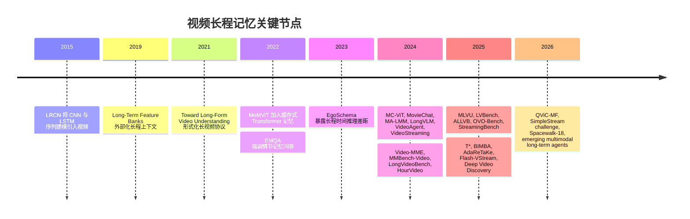
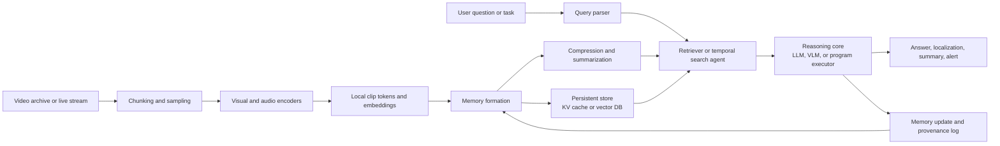

# 视频长程记忆：现状、架构与未来

## 执行摘要

本文把**视频长程记忆**定义为模型或系统对**时间上相距很远、分布稀疏，或已经不在当前视觉窗口中的信息进行保留、检索和推理**的能力。在这个定义下，该领域大致覆盖三类问题：面向分钟到小时级视频的**离线长视频理解**，只能看到因果前缀的**在线/流式视频理解**，以及正在兴起的、关注长时间场景、身份和世界状态一致性的**长时域视频建模与生成**。这一操作性定义也与 EgoSchema、LongVideoBench、MLVU、OVO-Bench 等基准的设计思路一致：视频智能不只是“看见”，还包括“记住”和“推理”。 citeturn1search4turn16view2turn17view0turn18view0turn15search0

从历史看，视频长程记忆经历了从 LRCN 等**序列模型**，到用于识别任务的**外部特征库与循环记忆**，再到 MeMViT、MC-ViT 等 Transformer 时代的**长上下文机制**，最后进入当前由压缩、记忆库、检索、时间搜索和智能体工具使用共同组成的**混合系统**阶段。今天最强的结果通常不是靠把更多帧直接塞进更大的 Transformer，而是靠更主动的信息流管理：循环记忆传播、层次压缩、查询感知检索，或多步时间搜索。 citeturn4search8turn31search3turn4search7turn10search5turn3search6turn3search13turn2search1turn7search0

当前基准结果并不轻松。HourVideo 报告了明显的人类-模型差距：人类专家达到 **85.0%**，Gemini Pro 1.5 为 **37.3%**。LongVideoBench 显示，当给足帧数后，最好的开放模型已经接近闭源系统，但视频时长增加后分数仍会明显下降。在 **2026-07-10** 访问的 LVBench 排行榜上，公开最高条目是 **Deep Video Discovery**，总分 **74.2%**，而 GPT-4o 被列为 **48.9%**；这说明一旦视频变得很长且信息密集，记忆感知检索和智能体式搜索会非常关键。StreamingBench 上，模型在实时感知上的整体得分明显高于上下文理解，说明**近场景感知的进步快于持久记忆与时间推理**。 citeturn17view1turn27view2turn16view0turn16view1

最重要的技术结论是：领域正在收敛到一个系统观点，即**视频长程记忆不是一个单点问题，而是表示、压缩、检索、时间定位和推理之间的协同问题**。与此同时，2026 年的 **SimpleStream** 等工作表明，一些声称来自“记忆”的收益，在强近期上下文基线面前会消失。因此，未来进展需要更严格的评估和消融，而不是默认堆叠更复杂的记忆模块。 citeturn9search1turn15search0turn18view0turn18view1

## 假设、定义与范围

原报告写于 **2026-07-10**，这里的“当前”指截至该日期公开可获得的论文、排行榜、项目页和官方产品文档。对于公开信息缺失的地方，尤其是闭源系统的内部机制，本文只陈述可见证据或明确标注为推断。

需要先给出操作性定义，因为社区尚未形成统一术语。本文认为，一项任务或方法只要满足以下任一条件，就属于**视频长程记忆**：需要利用分布在远距离时间戳上的证据回答问题；需要在模型即时输入窗口之外维护持久状态；或需要在连续流或生成序列中保持长时域一致性。EgoSchema 提出的 **temporal certificate sets** 很关键，因为它强调仅看片段长度并不能衡量真实的时间难度。LongVideoBench 也强调单帧或少量稀疏帧无法解决的 **referred reasoning**。MLVU 则指出，很多早期“长视频”评测并不是真正的长记忆任务，因为部分问题可以靠单帧、名人先验或纯文本线索回答。 citeturn1search4turn16view2turn17view0

在这个定义下，本文覆盖三类工作。第一类是**长视频理解**，包括问答、字幕生成、检索、动作识别，以及分钟到小时级视频上的长时域多模态推理。第二类是**流式/在线视频理解**，系统在时刻 \(t\) 只能使用因果前缀，因此必须体现时间意识和记忆更新能力。第三类是更广义的**长时域世界或场景建模**，其中记忆用于在生成镜头或长 rollout 中保持身份、几何和状态一致性。公开研究目前在前两类上更密集，第三类仍相对早期。 citeturn18view0turn18view1turn19search0turn29search9

本文有意排除两类内容，除非它们明确涉及记忆。第一，普通短片段动作识别或通用视频语言模型，不会因为输入是“视频”就被视为长记忆方法。第二，并非所有长视频基准都是真正的长记忆基准，因为有些基准可被激进稀疏采样、字幕或浅层时间启发式部分解决。这一区分对理解结果和判断基准饱和都很重要。 citeturn16view2turn17view0turn1search17

## 历史演进与关键节点

视频长程记忆的最早阶段，本质上是**序列建模**，而不是显式记忆设计。LRCN 把 CNN 感知与 LSTM 序列建模结合起来，形成了处理可变长度视觉输入并生成序列输出的模板。这一路线引入了“时间状态很重要”的直觉，但还没有解决长时域视频中保留丰富证据所需的计算和存储问题。 citeturn4search8

第二阶段引入了**外部化的长程上下文**。Long-Term Feature Banks 提出存储整个视频范围内的辅助信息，让短片段识别器能够使用即时窗口之外的上下文，并在 AVA、EPIC-Kitchens 和 Charades 上取得当时的领先结果。这是一个重要概念节点，因为它把“当前处理”和“历史支撑”分离开来，而这仍是许多现代长记忆架构的核心系统思想。与此同时，字幕生成和问答中也出现了记忆导向工作，例如 memory-attended captioning 和 episodic memory reader，不过这些系统比后来的 VideoLLM 更窄、更难扩展。 citeturn31search0turn31search3turn4search1turn4search10

到 2021-2022 年，**长视频理解作为独立研究问题**变得更加清晰。“Towards Long-Form Video Understanding” 指出短期模型难以在长时域中上下文化事件，并提出了长视频任务的大规模评估协议。MeMViT 进一步表明，多尺度视觉 Transformer 内部的在线记忆可以用仅 **4.5%** 的额外计算，把时间支持扩展 **30×**，并提升 AVA 和 EPIC-Kitchens-100 上的识别结果。同一时期，EMQA 把情节记忆问答定义为带显式定位要求的长时域 VideoQA。 citeturn31search2turn4search7turn4search14

2023 年以后进入现代阶段，因为社区终于获得了更具诊断性的**长记忆基准**。EgoSchema 表明，即使是非常大的模型，在真正的长时域第一人称问答上也明显不足，并通过 intrinsic temporal length 衡量长程时间难度。2024 年，评测范围显著扩张：Video-MME 覆盖 **11 秒到 1 小时** 和多种模态；MMBench-Video 引入长篇网页视频和基于 GPT-4 的自由回答评估；LongVideoBench 明确针对交错视频与字幕中的长上下文指代推理；HourVideo 则推进到 **20-120 分钟** 的第一人称视频，并呈现巨大的人类-模型差距。这些基准共同迫使领域超越“更多帧等于更好视频模型”的简单叙事。 citeturn1search4turn16view3turn13search8turn1search11turn17view1

与此同时，2024 年出现了一批**记忆感知 VideoLLM**：MovieChat、MA-LMM、LongVLM、VideoAgent、MC-ViT 和 VideoStreaming 分别提出不同方式，让长程信息在不把每一帧都送入最终 LLM 的情况下仍可访问。2025 和 2026 年的下一波转向更加明显：**查询感知检索、压缩和智能体式搜索**开始在困难基准上超过单体编码器。T* 把时间搜索重构为空间搜索问题，AdaReTaKe 将上下文容量从 **256 帧** 推到 **2048 帧**，Flash-VStream 强调实时流式延迟，Deep Video Discovery 领先 LVBench 排行榜，QViC-MF 则表明记忆不应只从感知接收压缩信息，也应**反馈**到当前视觉处理本身。简言之，问题已经从“如何记住更多”转向“如何记住正确的东西、低成本检索，并可靠推理”。 citeturn2search6turn3search6turn3search8turn20view4turn10search5turn3search13turn8search2turn21view5turn9search2turn7search0turn21view4

关键节点可以概括如下。

## 当前模型、架构、数据集与指标

### 主导架构模式

到 2026 年中，领域可以大致分为四类架构。第一类是**循环或流式记忆**：片段按因果顺序处理，一个固定大小的记忆向前传播。MeMViT、MA-LMM、VideoStreaming、Flash-VStream 和 StreamMem 都属于这一类，它们通过携带紧凑摘要、缓存或记忆库，避免对全部帧做完整二次复杂度注意力。 citeturn4search7turn3search6turn3search13turn9search2turn7search3

第二类是**层次化压缩**，目标是在减少 token 数量的同时保留足够细节。LongVLM 使用片段级 token merging 与全局语义；MC-ViT 做非参数化记忆整合；BIMBA 用 selective-scan/state-space 压缩替代注意力式压缩；ReTaKe 和 AdaReTaKe 明确处理时间、层和知识状态中的冗余；QViC-MF 则让压缩变成问题感知，并允许记忆反馈到当前视觉处理。 citeturn3search0turn10search5turn9search0turn8search0turn7search1turn10search6

第三类是**查询感知检索与智能体式搜索**。这些系统不会把整段视频压成一个统一记忆状态，而是在问题出现时搜索可能的证据。VideoAgent 使用带视觉工具的 LLM agent；VideoTree 构建层次化查询自适应树；T* 进行迭代时间搜索；VCA 用好奇心驱动探索；Deep Video Discovery 在多粒度可搜索视频数据库上做规划。这类方法在超长视频上往往更强，因为它们把计算花在证据所在处，而不是平均铺到所有地方。 citeturn20view4turn2search1turn8search2turn2search10turn7search0

第四类是越来越重要的**怀疑性基线**。SimpleStream 表明，在一些流式基准上，只看最近若干帧的滑动窗口可以匹配甚至超过更复杂的记忆系统。这并不意味着长记忆不必要，而是意味着未来论文必须与强近期上下文基线比较，并证明收益确实来自延迟证据、回溯、因果关联或先摄入后提问等记忆特定场景。 citeturn9search1turn18view0turn18view1

### 代表性模型对比

下表比较了若干代表性系统。需要注意，表中性能数字**不能跨行直接比较**，因为任务、模态和评估协议差异很大。这种异质性本身就是该领域的重要事实。 citeturn16view2turn17view0turn17view1

| 名称 | 年份 | 核心想法 | 记忆机制 | 使用数据集 | 性能 | 局限 |
|---|---:|---|---|---|---|---|
| MeMViT citeturn4search7 | 2022 | 用于长程识别的在线多尺度 Transformer | 来自先前片段的缓存注意力记忆 | AVA; EPIC-Kitchens-100 | 以仅 **4.5%** 额外计算扩展 **30×** 时间支持，并在 AVA 与 EPIC-Kitchens-100 上报告 SOTA citeturn4search7turn4search3 | 偏识别任务，不面向开放式长视频 QA 或多模态对话 |
| MC-ViT citeturn10search5 | 2024 | 用非参数记忆整合复用预训练视频 Transformer | 由过去激活整合出的记忆 | EgoSchema; Perception Test; Next-QA; Diving48 | MC-ViT-L 在 EgoSchema full、Perception Test、Next-QA 上分别报告 **44.4 / 48.1 / 65.0** citeturn26view2 | 需要任务特定微调；与分钟到小时级 VideoLLM 设置仍有差距 |
| MovieChat citeturn2search6 | 2024 | 面向超长视频对话的 dense-to-sparse 记忆 | 短期与长期 Transformer 记忆 token 加滑窗 | MovieChat-1K; MSVD-QA; MSRVTT-QA; ActivityNet-QA | 可在 **24GB** GPU 上处理 **>10K 帧**；短视频 QA 分数 **75.2 / 52.7 / 45.7** citeturn22view0turn22view4 | 偏电影场景，与 LVBench/StreamingBench 等新长记忆基准不完全对齐 |
| MA-LMM citeturn3search6 | 2024 | 可插拔长时记忆多模态 LLM | 顺序处理与压缩记忆库 | LVU; Breakfast; COIN; MSRVTT; MSVD; ActivityNet; YouCook2 | LVU 平均 **63.0**；Breakfast **93.0**，COIN **93.2**，MSVD QA **60.6** citeturn25view4 | 问题无关记忆可能遗漏罕见任务细节；主要是离线设置 |
| LongVLM citeturn3search0 | 2024 | 片段局部特征加全局语义 | 跨短片段的层次 token merging | VideoChatGPT; ANET-QA; MSRVTT-QA; MSVD-QA | ANET-QA / MSRVTT-QA / MSVD-QA 为 **47.6 / 59.8 / 70.0** citeturn23view3 | 关注高效长视频编码，但缺少显式检索或流式交互 |
| VideoStreaming citeturn3search13 | 2024 | 恒定 token 流式编码器与自适应记忆选择 | 记忆传播式流式编码和问题条件记忆选择 | EgoSchema; Next-QA; Next-GQA; MovieChat-1K; MovieNet-QA | EgoSchema fullset **44.1**，Next-QA **66.2**，Next-GQA Acc@GQA **17.8** citeturn24view2turn30view0 | 多阶段设计；质量依赖选择准确性与摘要质量 |
| VideoTree citeturn2search1 | 2024 | 免训练层次查询自适应树 | 查询感知帧选择与层次聚合 | EgoSchema; NExT-QA; Video-MME long | EgoSchema **61.1%**，NExT-QA **75.6%** citeturn2search1 | 搜索时延较高；依赖查询可用性与 caption/retrieval 质量 |
| AdaReTaKe citeturn7search1 | 2025 | 时间和层上的自适应冗余削减 | 免训练压缩视觉冗余和 KV 状态 | Video-MME; MLVU; LongVideoBench; LVBench | 处理能力从 **256 帧** 扩展到 **2048 帧**；7B 和 72B 分别提升 **2.3% / 2.8%** citeturn21view5turn7search1 | 仍是压缩式方法，罕见线索可能丢失；收益依赖基础模型 |
| Deep Video Discovery citeturn7search0 | 2025 | 在索引视频片段上做多粒度工具搜索 | 可搜索分段视频数据库与迭代工具使用 | 多个长视频基准，尤其 LVBench | LVBench 公开榜列出 **74.2%** 总分，高于 GPT-4o 的 **48.9%** citeturn16view0turn7search0 | 基础设施复杂；检索库构建和工具编排成本不低 |
| Flash-VStream citeturn9search2 | 2025 | 面向实时长视频流的双进程架构 | Flash Memory，含上下文概要和细节增强记忆 | EgoSchema; MLVU; LVBench; MVBench; Video-MME | 首 token **1 秒内**生成，并在完整 EgoSchema 上报告强效率-准确率权衡 citeturn20view8 | 为实时场景优化，可能牺牲部分离线穷尽推理 |
| QViC-MF citeturn10search6 | 2026 | 问题引导压缩与记忆反馈 | 问题感知选择性注意力加迭代记忆反馈 | MLVU; LVBench; VNBench Long; VideoMME Long | 相对先前 SOTA 在 MLVU、LVBench、VNBench Long、VideoMME Long 上分别提升 **6.1% / 8.3% / 18.3% / 3.7%** citeturn21view4 | 查询感知设计很强，但不太适合摄入阶段未知问题的归档场景 |

一个单独但重要的 2026 结果是 **SimpleStream**：它只使用最近帧、没有显式长期记忆，却用四帧近期上下文在 OVO-Bench 和 StreamingBench 上达到 **67.7%** 与 **80.59%**。这在分析上很重要，因为它说明一些过去归因于“记忆”的增益，至少部分可能来自更强的近场景感知或更好的 backbone。未来论文需要在匹配协议下证明真正的长记忆优势。 citeturn9search1

### 基准与数据集格局

基准生态已经丰富很多，现在不仅看总体 QA 准确率，也开始诊断不同形式的记忆失败。

| 基准 | 年份 | 范围与时长 | 主要任务 | 主要指标 | 重要性 | 主要注意点 |
|---|---:|---|---|---|---|---|
| EgoSchema citeturn1search4 | 2023 | 超过 250 小时、3 分钟第一人称视频，>5,000 人工 MCQ | 长视频 VideoQA | Accuracy | 引入 temporal certificate sets，诊断内在时间难度 | 仍是选择题且限第一人称 |
| Video-MME citeturn16view3 | 2024 | 900 个视频，254 小时，**11 秒到 1 小时**，含视频、字幕、音频 | 广义视频理解 | Accuracy citeturn13search9 | 广泛使用的全谱系多时长多模态基准 | 饱和趋势推动 Video-MME-v2 citeturn1search17 |
| MMBench-Video citeturn13search8 | 2024 | 长篇多镜头网页视频与人工自由问题 | 通用视频理解 | 基于 GPT-4 的自动评估 | 支持开放式回答和时间推理分类 | 依赖评审模型 |
| LongVideoBench citeturn1search11 | 2024 | 3,763 个交错视频-字幕样本，最长 **1 小时** | 长上下文指代推理 | 分时长准确率与总分 | 压测稀疏指代证据与长上下文多模态整合 | 主要仍是离线 QA |
| HourVideo citeturn17view1 | 2024 | 500 个 Ego4D 视频，**20-120 分钟**，12,976 道 MCQ | 总结、感知、因果/反事实推理、导航 | 五选一准确率 | 小时级视频中最清晰的人类-模型差距之一 | 仅第一人称 |
| StreamingBench citeturn18view1 | 2024 | 900 个视频，4,500 QA，问题在多个时间点提出 | 流式理解 | Overall、real-time、omni-source、contextual | 区分近场景感知与上下文记忆需求 | 第一代流式基准 |
| MLVU citeturn17view0 | 2025 | **3 分钟到 2 小时**，覆盖电影、监控、第一人称和动画 | 多任务长视频理解 | M-Avg、G-Avg 与任务分数 | 覆盖整体、单细节、多细节任务 | 多指标使排行榜比较复杂 |
| OVO-Bench citeturn18view0 | 2025 | 644 个视频，约 2,800 个带时间戳标注 | 在线时间意识 | backward tracing、real-time、forward active responding 准确率 | 诊断因果前缀推理与何时回答/等待 | 对多模态归档检索强调较少 |
| LVBench citeturn16view4 | 2025 | 覆盖电视、体育、监控等的极长视频基准 | 长视频理解与信息抽取 | Accuracy 与类别细分 | 非常困难，强烈奖励检索和智能体式搜索 | 公开榜动态变化且混合不同模型类型 |
| ALLVB citeturn17view4 | 2025 | **1,376 个视频**，**16 类**，平均近 **2 小时**，**252k QAs** | 9 类主要任务的一体化 QA | 单项与平均任务准确率 | 规模最大的 all-in-one 长视频基准之一 | GPT-4o 辅助自动标注带来评测设计问题 |
| Causal2Needles citeturn14search7turn14search19 | 2025 | 含因果相关远距离事件的长上下文视频 | 两个时间“needle”的联合推理 | Accuracy | 明确压测远距离事件因果关联 | 较新且范围窄于通用基准 |
| Spacewalk-18 citeturn14search1turn14search9 | 2026 | 长篇 ISS 太空行走流程视频，多模态线索 | 步骤识别与视频 QA | 任务准确率 | 对领域迁移和长流程记忆有价值 | 领域特定，难与网页视频基准直接比较 |

两个基准趋势尤其重要。第一，**视频越长通常越难，即使对前沿模型也是如此**，因此按时长分桶比单一平均分更有信息量。LongVideoBench 官方榜显示 GPT-4o 总分 **66.7**，但在最长的 **900-3600 秒**组只有 **61.6**；当给足帧数后，最好的开放英文模型已经接近。第二，评估正在分叉为更专门的探针：OVO-Bench 的时间意识、StreamingBench 的上下文流式理解、MLVU 的多细节分解、VNBench 的合成稀疏线索，以及 Causal2Needles 的远距离因果事件关联。 citeturn27view2turn18view0turn18view1turn28view2turn14search14turn14search19

### 评估指标到底测什么

| 指标族 | 使用者 | 衡量内容 | 优点 | 局限 |
|---|---|---|---|---|
| 多选准确率 | EgoSchema, Video-MME, HourVideo, LVBench citeturn1search4turn13search9turn17view1turn16view0 | 正确选项选择 | 便宜、可复现、兼容排行榜 | 可能饱和，且混合记忆、指令遵循和选项解析能力 |
| 平均任务准确率与任务均值 | MLVU 的 **M-Avg** 和 **G-Avg** citeturn30view3turn28view2 | 多细节和生成任务的平均表现 | 比单一总分更适合异构任务套件 | 可能掩盖特定子能力灾难性失败 |
| 按时长分层准确率 | LongVideoBench; Video-MME 排行榜 citeturn27view2turn16view3 | 表现是否随上下文增长下降 | 直接诊断时间跨度扩展能力 | 仍不显示模型是否检索到正确证据 |
| LLM 辅助自由回答评分 | MMBench-Video 与 LongVLM/MovieChat 中 VideoChatGPT 式评估 citeturn13search8turn23view3turn22view4 | 回答质量、细节、一致性 | 支持 MCQ 之外的开放回答 | 评审偏差、prompt 敏感、证据归因弱 |
| 时间 grounding 指标，如 IoU、IoP、Acc@GQA | Next-GQA 与 VideoStreaming citeturn30view0 | 模型是否定位证据并视觉 grounding | 更接近真实长记忆检索质量 | 标注昂贵，覆盖仍有限 |
| Needle、排序和计数准确率 | VNBench 与相关合成探针 citeturn14search14turn14search10 | 恢复稀疏远距离线索 | 有利于隔离记忆失败模式 | 合成任务可能偏离自然叙事理解 |
| 效率指标，如帧预算、token、延迟、首 token 时间、显存 | MovieChat, AdaReTaKe, Flash-VStream, SimpleStream citeturn22view0turn21view5turn20view8turn9search1 | 记忆成本与实时可用性 | 对部署和公平系统比较必不可少 | 硬件、精度和预处理设置尚不标准 |

核心评估问题在于：领域仍缺乏类似语言建模 perplexity 的**统一记忆专用指标**。今天的排行榜主要衡量任务成功，却只能部分暴露方法是否真正保留并检索了远距离证据、是否幻觉了无支撑关联、随时间遗忘了多少，以及为此消耗了多少计算。这也是为什么同一类模型在一个基准上强、在另一个基准上弱。基准设计者因此越来越多地加入时长切片、时间定位指标和流式协议。 citeturn16view2turn18view0turn18view1turn28view2

## 实际系统与产业部署

公开产业部署目前更强调**可用的记忆系统**，而不是学术上纯粹的长视频编码器。商业文档中常见两类模式。第一类是带托管预处理、服务器端压缩和时间戳媒体摄入的**超长上下文多模态模型**。第二类是**embedding + retrieval 栈**：视频被分段、索引、语义搜索，再由语言模型总结或回答问题。从公开文档看，检索中心模式更容易部署，因为它更易扩展、审计并集成到企业数据库中。这一点是根据产品架构和文档作出的推断，并非厂商披露的定理。 citeturn11search0turn11search2turn12search3turn12search7turn12search8turn11search5turn11search11

| 公开系统 | 公开能力 | 外部可见记忆策略 | 公开部署证据 | 未公开内容 |
|---|---|---|---|---|
| Google Gemini API for video citeturn11search0turn11search2 | 所有 Gemini 模型可处理视频；**1M-context** 模型默认媒体分辨率可处理 **1 小时**，低分辨率可达 **3 小时** | 长上下文加服务器端媒体降采样；File API 以 **1 fps** 存视频、**1 Kbps** 存音频，并带 1 秒时间戳 | 官方开发者文档与长上下文指南 | 内部长记忆架构、检索策略和证据轨迹未公开 |
| Gemini Live API citeturn11search10 | 低延迟连续语音与视觉交互 | 会话中的连续流式输入状态 | 官方 preview 文档 | 未公开持久视觉记忆如何表示 |
| TwelveLabs Marengo and Pegasus on Amazon Bedrock citeturn12search0turn12search3turn12search8turn12search12 | 托管视频搜索、场景分类、总结和问答 | 持久多模态 embedding 加分析模型；外部向量记忆是可见抽象 | AWS 发布文章与 Bedrock model card | 训练混合、检索启发式以及与学术长记忆基准的可比性 |
| TwelveLabs + 向量数据库集成 citeturn11search5turn11search11turn12search5turn12search9 | 使用 Qdrant、Chroma、OpenSearch 或 S3 Vectors 做语义视频搜索与多模态 RAG | 对分段视频 embedding 建持久向量存储 | 官方教程与合作方集成 | 多小时归档上的端到端 QA 忠实度与召回 |
| TwelveLabs lecture-analysis tutorial on Bedrock citeturn12search17 | 从教育视频生成学习指南、章节时间线、转录和练习题 | 对嵌入的长视频做检索和总结 | 官方应用教程 | 教程领域之外的泛化与精确评估协议 |

一种有用的理解方式是：**产业部署把记忆暴露为基础设施，而研究论文常把记忆暴露为内部神经模块**。产品中的“记忆”通常意味着持久 embedding、可搜索索引、缓存媒体表示或上下文管理的多模态会话；论文中的“记忆”则更多是 token、潜状态或可学习读写库。这解释了为什么研究排行榜和生产栈解决的是相近问题，但看起来会很不一样。 citeturn11search0turn12search7turn7search0turn20view8

典型部署架构大致如下。

这个流程抽象了 VideoStreaming 的记忆传播与自适应选择、VideoTree 的查询自适应证据树、Flash-VStream 的定长流式记忆、Deep Video Discovery 的可搜索多粒度工具栈，以及 Google 和 TwelveLabs 文档中体现的 embedding + retrieval 工作流。 citeturn3search13turn2search1turn9search2turn7search0turn11search0turn12search7

两个 caveat 很重要。第一，公开产品文档通常宣传**能力**而不是算法细节，因此很难像学术论文那样精确识别记忆机制。第二，部署产品与学术长记忆模型之间可复现的公开比较仍然很少。厂商博客中的应用教程应被视为部署模式证据，而不是受控科学基准。 citeturn11search0turn12search17turn12search5

## 开放问题、技术挑战与未来方向

### 为什么这个问题仍然难

第一项持续挑战是**信息稀疏下的可扩展性**。自然视频大多数时候高度冗余，但在少数关键时刻又极端信息密集。全量注意力太贵，激进压缩又可能删除之后问题依赖的那一帧、字幕、物体状态或声音线索。MeMViT、MC-ViT、BIMBA、ReTaKe、AdaReTaKe 和 Flash-VStream 分别处理这个问题的不同部分，这本身说明尚无单一压缩方案胜出。SimpleStream 的结果进一步强化了这一点：如果记忆方法无法在记忆特定任务上击败强近期窗口基线，它可能没有解决真正瓶颈。 citeturn4search7turn10search5turn9search0turn8search0turn7search1turn9search2turn9search1

第二项挑战是**表示**。长记忆系统必须同时保存至少三类信息：细粒度视觉细节、事件结构和抽象语义。如果只存抽象摘要，会丢失局部或断点问题所需证据；如果只存片段或帧，检索太贵且记忆膨胀；如果只存查询感知信息，则在摄入阶段问题未知时会变脆弱。因此当前系统越来越走向分层记忆：局部细节记忆、全局叙事记忆和外部可搜索记忆越来越常同时出现在同一栈中。 citeturn2search6turn20view8turn10search6turn29search0

第三项挑战是**检索与时间推理**。许多困难问题并不是识别一个动作，而是连接分散线索：两个时刻之间发生了什么变化，什么导致了后续事件，或者何时积累了足够证据可以回答。LongVideoBench、OVO-Bench、HourVideo 和 Causal2Needles 都强调这种推理。VideoTree、T*、VideoAgent、VCA 和 Deep Video Discovery 的出现说明领域已经认识到：只有长记忆而没有好的时间搜索，往往不够。 citeturn16view2turn18view0turn17view1turn14search19turn2search1turn8search2turn20view4turn2search10turn7search0

第四项挑战是**持续学习与跨会话持久性**。大多数标准基准仍然只围绕单个视频提问。但真实 agent 应当跨 episode 累积知识、建立关于重复实体的语义记忆、更新信念，并避免灾难性遗忘。M3-Agent 是重要一步，因为它显式区分情节记忆和语义记忆，并引入 M3-Bench 评估更长 agent 设置中的记忆推理。但这个子领域仍很年轻，“infinite video understanding” 目前更像研究议程，而不是成熟基准生态。 citeturn29search0turn29search2

第五项挑战是**标注与基准质量**。长视频标注昂贵、质控困难，而且尤其容易受到纯文本捷径或数据泄漏影响。LVBench 混合人工标注和模型辅助；ALLVB 使用自动化 GPT-4o 流水线并加人工质控；VideoNIAH/VNBench 用合成 needle 插入降低标注成本并隔离特定能力。这些方法很聪明，但也带来风险：基准可能测试了标注流程偏差，而不只是模型记忆。 citeturn16view4turn17view4turn14search14turn14search10

### 具体挑战图谱

| 挑战 | 难点 | 代表证据 | 有希望的方向 |
|---|---|---|---|
| 可扩展性 | token 数随时间增长，但显著证据稀疏 | MeMViT 30× 时间支持；AdaReTaKe 256→2048 帧；Flash-VStream 追求亚秒响应 citeturn4search7turn21view5turn20view8 | 层次压缩、状态空间模型、稀疏 KV 记忆、更强效率报告 |
| 表示 | 需要同时保留局部细节和全局语义 | MovieChat、MA-LMM、QViC-MF、M3-Agent 对记忆角色做不同拆分 citeturn22view0turn25view4turn21view4turn29search0 | 显式局部、情节、语义存储的多层记忆 |
| 检索 | 远距离证据不只要存，还要低成本找到 | VideoTree、T*、VideoAgent、Deep Video Discovery citeturn2search1turn8search2turn20view4turn7search0 | 将检索策略与推理联合学习；增加 provenance 输出 |
| 时间推理 | 变化、因果和延迟后果连接仍弱 | HourVideo 人类 85.0 vs Gemini 37.3；Causal2Needles 和 OVO-Bench 暴露缺口 citeturn17view1turn14search19turn18view0 | 因果训练数据、时间程序、事件图 |
| 流式时间意识 | 系统必须知道自己看过什么、没看过什么，以及何时回答 | OVO-Bench、StreamingBench、SimpleStream citeturn18view0turn18view1turn9search1 | 区分当前场景感知与长记忆检索的基准 |
| 持续学习 | 需要更新记忆且避免灾难性遗忘 | M3-Agent 与 Infinite Video Understanding 议程 citeturn29search0turn29search2 | 跨会话基准、回放、语义记忆整合 |
| 标注与监督 | 长视频标注贵且容易产生捷径 | LVBench、ALLVB、VideoNIAH / VNBench citeturn16view4turn17view4turn14search14 | Human-in-the-loop 流水线，合成探针加自然基准 |
| 评估忠实度 | 正确率不证明正确检索了记忆 | MMBench-Video judge 评分；Next-GQA grounding；Video-MME-v2 饱和担忧 citeturn13search8turn30view0turn1search17 | 证据 grounded 评分、保留曲线、校准不确定性、匹配成本比较 |

### 有希望的未来方向

最有希望的方向可能是把**层次记忆作为系统原语**，而不是单个模块。可能胜出的设计会结合用于近期感知的快速 **working memory**、用于可检索片段证据的 **episodic store**，以及用于整合可复用事实、实体和事件抽象的 **semantic memory**。这已经体现在 M3-Agent 的情节/语义拆分、Flash-VStream 的上下文概要与细节增强记忆拆分，以及 2026 年综述所说的“watch, remember, reason” 视角中。 citeturn29search0turn20view8turn15search0

第二个方向是**记忆感知训练目标，而不只是记忆感知推理**。许多当前方法是免训练或推理时包装，这很实用，但也限制了模型学习如何形成记忆、遗忘或检索。未来系统可能会直接围绕证据定位、延迟提问、归档复用和预算约束下的记忆压缩进行训练，而不仅依赖短视频 QA 的指令微调。QViC-MF 和 ReWind 已经指向这种更紧密耦合任务与记忆行为的方向。 citeturn10search6turn31search20

第三个方向是**带 provenance 的智能体式时间搜索**。T*、VideoTree、Deep Video Discovery 和 VideoARM 表明，长视频推理通常受益于显式搜索循环，而非一次性推理。下一步应让系统更可审计：当模型回答时，应引用使用过的片段区间、帧、字幕或音频片段；基准也应验证答案正确性和证据忠实度。 citeturn8search2turn2search1turn7search0turn8search18

第四个方向是**基准重设计**。强未来基准至少应结合五个成分：自然长视频、延迟问题、多 needle 或因果依赖、匹配成本协议，以及 grounded 评估。现有基准中已经散落了这些组件，如 EgoSchema、LongVideoBench、OVO-Bench、StreamingBench、Causal2Needles 和 Spacewalk-18。缺少的是一个统一评测套件，同时衡量保留、检索、推理和效率。 citeturn1search4turn16view2turn18view0turn18view1turn14search19turn14search1

第五个方向涉及**视频建模与生成**。长记忆在生成侧越来越可见，但标准化程度仍低于理解侧。公开工作包括 **Corgi**，它用缓存记忆做多场景生成并报告长程一致性提升；**Video World Models with Long-term Spatial Memory**，使用几何 grounded 记忆维护持久世界状态；以及 **EM-Vid**，提出以实体为中心的记忆来提升多镜头生成的一致性。这些论文说明视频长程记忆的“建模”侧正在变得严肃。不过，截至 2026-07-10，相比基准丰富的理解侧，我没有看到同样成熟的公开长记忆视频生成基准生态；这个方向很有潜力，但结构上仍更早期。 citeturn19search18turn19search0turn29search9

我的底线判断是，下一次实质性进展更可能来自**统一摄入、压缩、检索、推理和证据归因的记忆感知多模态系统**，而不是单纯增加单体基础模型的原始帧预算。该领域近期最稳健的经验都指向这个方向。 citeturn7search0turn10search6turn29search0turn15search0

## 参考文献

Donahue, J. et al. *Long-Term Recurrent Convolutional Networks for Visual Recognition and Description*. CVPR 2015. citeturn4search8

Wu, C.-Y. et al. *Long-Term Feature Banks for Detailed Video Understanding*. CVPR 2019. citeturn31search0turn31search3

Wu, C.-Y., Krähenbühl, P. *Towards Long-Form Video Understanding*. CVPR 2021. citeturn31search1turn31search2

Wu, C.-Y. et al. *MeMViT: Memory-Augmented Multiscale Vision Transformer for Efficient Long-Term Video Recognition*. CVPR 2022. citeturn4search7turn4search3

Datta, S. et al. *Episodic Memory Question Answering*. CVPR 2022. citeturn4search14turn4search2

Mangalam, K. et al. *EgoSchema: A Diagnostic Benchmark for Very Long-form Video Language Understanding*. 2023. citeturn1search4turn1search16

Balažević, I. et al. *Memory Consolidation Enables Long-Context Video Understanding*. ICML 2024. citeturn10search5turn26view2

Song, E. et al. *MovieChat: From Dense Token to Sparse Memory for Long Video Understanding*. CVPR 2024. citeturn2search6turn22view0turn22view4

He, B. et al. *MA-LMM: Memory-Augmented Large Multimodal Model for Long-Term Video Understanding*. CVPR 2024. citeturn3search6turn25view4

Weng, Y. et al. *LongVLM: Efficient Long Video Understanding via Large Language Models*. ECCV 2024. citeturn3search8turn23view3

Wang, X. et al. *VideoAgent: Long-form Video Understanding with Large Language Model as Agent*. ECCV 2024. citeturn20view4

Qian, R. et al. *Streaming Long Video Understanding with Large Language Models*. NeurIPS 2024. citeturn3search13turn24view2

Fu, C. et al. *Video-MME: The First-Ever Comprehensive Evaluation Benchmark of Multi-modal LLMs in Video Analysis*. 2024. citeturn16view3turn13search9

Fang, X. et al. *MMBench-Video: A Long-Form Multi-Shot Benchmark for Holistic Video Understanding*. NeurIPS 2024 Datasets and Benchmarks. citeturn13search8

Wu, H. et al. *LongVideoBench: A Benchmark for Long-context Interleaved Video-Language Understanding*. NeurIPS 2024 Datasets and Benchmarks. citeturn1search11turn16view2

Chandrasegaran, K. et al. *HourVideo: 1-Hour Video-Language Understanding*. NeurIPS 2024 Datasets and Benchmarks. citeturn17view1

Zhou, J. et al. *MLVU: Benchmarking Multi-task Long Video Understanding*. CVPR 2025. citeturn17view0turn28view2

Wang, W. et al. *LVBench: An Extreme Long Video Understanding Benchmark*. ICCV 2025. citeturn5search19turn16view0

Tan, X. et al. *ALLVB: All-in-One Long Video Understanding Benchmark*. AAAI 2025. citeturn17view4

Li, Y. et al. *OVO-Bench: How Far is Your Video-LLMs from Real-World Online Video Understanding?* CVPR 2025. citeturn18view0

Lin, J. et al. *StreamingBench: Assessing the Gap for MLLMs to Achieve Streaming Video Understanding*. 2024. citeturn18view1

Zhao, Z. et al. *Needle In A Video Haystack: A Scalable Synthetic Evaluator for Video MLLMs*. 2024. citeturn14search14

Ye, J. et al. *T*: Re-thinking Temporal Search for Long-Form Video Understanding*. CVPR 2025. citeturn8search2turn20view5

Islam, M. M. et al. *BIMBA: Selective-Scan Compression for Long-Range Video Question Answering*. CVPR 2025. citeturn9search0turn9search4

Wang, X. et al. *AdaReTaKe: Adaptive Redundancy Reduction to Perceive Longer for Video-language Understanding*. 2025. citeturn7search1turn21view5

Zhang, X. et al. *Deep Video Discovery: Agentic Search with Tool Use for Long-form Video Understanding*. 2025. citeturn7search0turn7search4

Zhang, H. et al. *Flash-VStream: Efficient Real-Time Understanding for Long Video Streams*. ICCV 2025. citeturn9search2turn20view8

Long, L. et al. *Seeing, Listening, Remembering, and Reasoning: A Multimodal Agent with Long-Term Memory*. 2025. citeturn29search0turn29search8

Li, M., Chao, Q., Li, B. *Two Causally Related Needles in a Video Haystack*. NeurIPS 2025 Datasets and Benchmarks. citeturn14search19turn14search7

Yamao, S. et al. *Question-guided Visual Compression with Memory Feedback for Long-Term Video Understanding*. CVPR 2026. citeturn10search6turn21view4

Shen, Y. et al. *A Simple Baseline for Streaming Video Understanding*. 2026. citeturn9search1

Tang, Z. et al. *Spacewalk-18: A Benchmark for Multimodal and Long-form Procedural Video Understanding in Novel Domains*. WACV 2026. citeturn14search1turn14search9

Meng, J. et al. *Watch, Remember, Reason: Human-View Video Understanding with MLLMs*. 2026. citeturn15search0

Wu, T. et al. *Video World Models with Long-term Spatial Memory*. 2025. citeturn19search0turn19search15

Wu, X. et al. *Corgi: Cached Memory Guided Video Generation*. WACV 2025. citeturn19search18

Vandersanden, J. et al. *EM-Vid: Training-Free Entity-Centric Memory for Efficient and Consistent Multi-Shot Video Generation*. 2026. citeturn29search9

Google. *Video understanding | Gemini API*. Official developer documentation. citeturn11search0

Google. *Long context | Gemini API*. Official developer documentation. citeturn11search2

Google. *Gemini Live API overview*. Official developer documentation. citeturn11search10

AWS. *TwelveLabs video understanding models are now available in Amazon Bedrock*. Official AWS announcement, 2025. citeturn12search0

AWS. *Introducing TwelveLabs in Amazon Bedrock*. Official Bedrock provider page. citeturn12search3

AWS. *TwelveLabs models now available fully managed in Amazon Bedrock*. Official AWS “What’s New”, 2025. citeturn12search8

AWS. *TwelveLabs Pegasus 1.2 model card for Amazon Bedrock*. Official documentation. citeturn12search12

TwelveLabs. *Amazon Bedrock integration docs*. Official documentation. citeturn12search7

TwelveLabs. *Semantic Video Search Workflow with Qdrant*. Official tutorial. citeturn11search5

TwelveLabs. *Multimodal RAG with Chroma*. Official tutorial. citeturn11search11

TwelveLabs. *Finding Needles in Video Haystacks with Marengo and Elasticsearch*. Official tutorial. citeturn12search5

TwelveLabs. *Lecture Analysis Platform on AWS Bedrock*. Official tutorial. citeturn12search17
