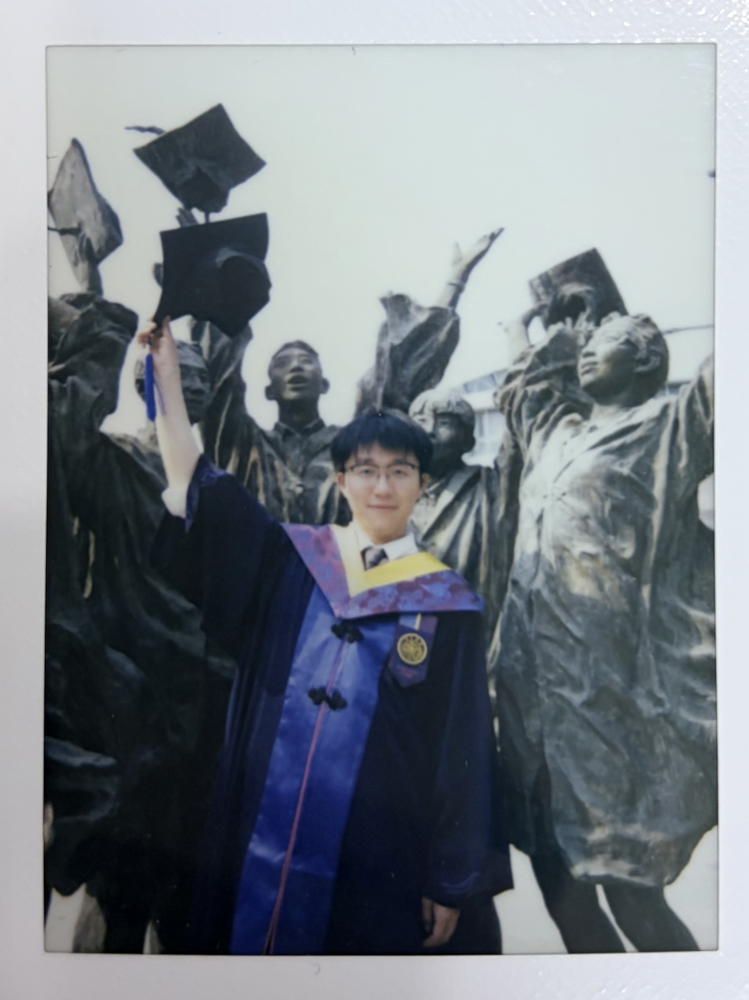

<table class="imgtable">
  <tr>
    <td>
      
    </td>
    <td align="left">
      
Master Student 
      <a href="https://www.tsinghua.edu.cn/en/">Tsinghua University</a> 
      Email: <a href="mailto:wanghc23@mails.tsinghua.edu.cn">wanghc23@mails.tsinghua.edu.cn</a>

    </td>
  </tr>
</table>

## About Me

I am a third-year master student in [Tsinghua University](https://www.tsinghua.edu.cn), under the supervision of Prof. Yuxing Han. I earned my bachelor's degree from [Beijing Jiaotong University](https://www.bjtu.edu.cn) in 2023.

My research interest focuses on **Machine Learning** and **Computer Vision**, especially **Efficient AI** algorithms and systems. From 2021, I started my research on efficient physiological time series analysis based on knowledge distillation. Then I focused on efficient video computer vision systems with video motion estimation from 2023 to 2025. In early 2026, I worked on generative human motion mimicking.

Currently, I am starting to explore World Models as my new research interest.

Feel free to contact me by email if you are interest in discussion or collarboration with me. I am now seeking oppotunities of full-time research assistant in 26 fall and Ph.D in 27 fall.

## Research Experience

- **Generative Human Motion Mimicking**
  - [Tsinghua University](https://www.tsinghua.edu.cn), China & [University of Cambridge](https://www.cam.ac.uk/), UK
  - Oct. 2025 - Present
  - Developed an algorithm using diffusion trajectory matching for controlled long-range motion generation.

- **Efficient Video Computer Vision with Motion Estimation**
  - [Tsinghua University](https://www.tsinghua.edu.cn), China
  - Oct. 2023 - Dec. 2025
  - Applied video motion estimation to accelerate the video computer vision system.
  - Proposed an efficient pipeline directly processing Bayer data, removing the ISP latency.

- **Physiological Signal Classification and System Design**
  - [Institute of Network Science and Intelligent System](http://insis.bjtu.edu.cn/), BJTU, China
  - May 2021 - Aug. 2023
  - Proposed a multi-level knowledge distillation framework for lightweight single-channel EEG physiological signal classification.
  - Proposed a spatial-temporal knowledge distillation framework for lightweight multi-channel physiological signal classification.
  - Developed MicroSleepNet, a lightweight model with low computational cost, for a physiological signal classification software.

## Education

- **Master of Science**
  - Data Science and Information Technology, [Tsinghua University](https://www.tsinghua.edu.cn)
  - 2023 - Present
  - Advisor: Prof. Yuxing Han
- **Bachelor of Engineering**
  - Computer Science and Technology, [Beijing Jiaotong University](https://www.bjtu.edu.cn)
  - 2019 - 2023

## Publications

1. Liang Heng, Yucheng Liu, **Haichao Wang**, and Ziyu Jia. "Teacher Assistant-Based Knowledge Distillation Extracting Multi-Level Features on Single Channel Sleep EEG." In *International Joint Conference on Artificial Intelligence (IJCAI)*. 2023. [[Paper]](http://ijcai.org/proceedings/2023/0439.pdf)

2. Liu Yucheng, Ziyu Jia, and **Haichao Wang**. "EmotionKD: A Cross-Modal Knowledge Distillation Framework for Emotion Recognition Based on Physiological Signals." In *ACM International Conference on Multimedia (ACM MM)*, 6122–31. 2023. [[Paper]](https://dl.acm.org/doi/abs/10.1145/3581783.3612277)

3. Jia Ziyu, Heng Liang, Yucheng Liu, **Haichao Wang**, and Tianzi Jiang. "DistillSleepNet: Heterogeneous Multi-Level Knowledge Distillation via Teacher Assistant for Sleep Staging." *IEEE Transactions on Big Data*, 2024. [[Paper]](https://ieeexplore.ieee.org/abstract/document/10663937)

4. Jia Ziyu, **Haichao Wang**, Yucheng Liu, and Tianzi Jiang. "Mutual Distillation Extracting Spatial-Temporal Knowledge for Lightweight Multi-Channel Sleep Stage Classification." In *ACM SIGKDD Conference on Knowledge Discovery and Data Mining*. 2024. [[Paper]](https://dl.acm.org/doi/abs/10.1145/3637528.3671981)

5. Jia Ziyu, Heng Liang, **Haichao Wang**, Yucheng Liu, and Tianzi Jiang. "Cross-Modal Knowledge Distillation for Enhanced Unimodal Emotion Recognition." *IEEE Transactions on Affective Computing*, 2025. [[Paper]](https://ieeexplore.ieee.org/abstract/document/11052680)

## Honors and Awards

- **National Prize**, National College Students' Innovation and Entrepreneurship Training Program
- **Second Prize**, Beijing Undergraduate Mathematical Contest in Modeling
- **Second Prize**, 11th "Challenge Cup" National Undergraduate Curricular Academic Science and Technology Works
